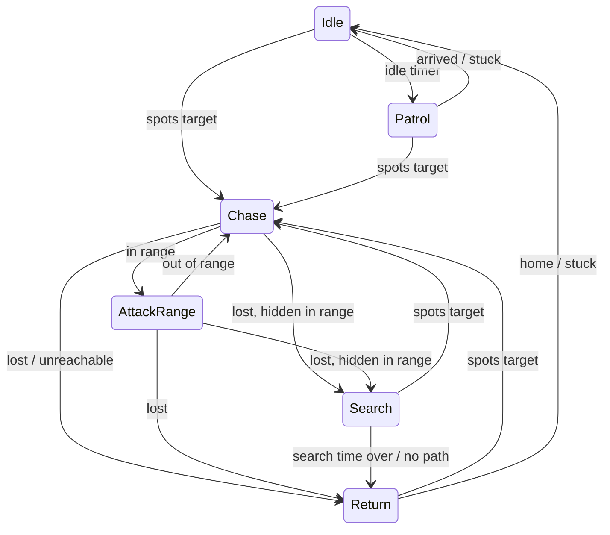
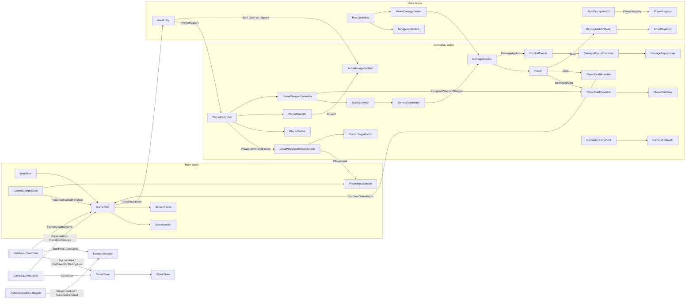

# Architecture

Code map for orienting quickly in the project. One section per system; keep headings stable and update the section that matches the code you change. Conventions and rules live in [CLAUDE.md](../CLAUDE.md); this file describes what exists.

All C# types are in the global namespace (no `namespace` declarations). Paths below are relative to this file.

## Overview

A Unity 6 (URP 2D) top-down action RPG prototype. The player boots into a main menu, starts a new game, and is placed in an area scene (currently the grass "Clearing") where they walk in 8 directions and swing a sword. Weasel mobs idle, patrol around their spawn, spot the player with line-of-sight checks, path around walls on a tilemap grid, crowd around the player without overlapping, and melee attack on a cooldown. Damage shows floating numbers and a HUD health bar. Mobs target whichever registered player they spot (nearest visible), so the code is ready for more than one player. A dead player respawns at the area's spawn point after a delay while a teammate is still alive; when every player is dead at once the current area restarts. A dev-only stress-test area spawns hundreds of mobs on a procedurally generated map to profile AI and pathfinding.

## Packages

Notable entries in [Packages/manifest.json](../Packages/manifest.json):

| Package | Used for |
|---|---|
| `jp.hadashikick.vcontainer` (OpenUPM) | Dependency injection, `LifetimeScope`s, entry points |
| `com.unity.inputsystem` | `InputSystem_Actions.inputactions`, `PlayerInputService`, UI input module |
| `com.unity.render-pipelines.universal` | URP 2D renderer, `Light2D` |
| `com.skner.dualgrid` (git) | `DualGridTilemapModule` for dual-grid terrain rendering |
| `com.unity.2d.tilemap` / `.extras` | Tilemaps for terrain, collision and navigation data |
| `com.unity.2d.aseprite`, `com.unity.2d.animation` | Sprite import and animation |
| `com.unity.ugui` + TextMesh Pro | Menu, HUD, damage popups |
| `com.unity.test-framework` | EditMode and PlayMode tests |
| `com.unity.netcode.gameobjects` 2.13.3 | Netcode for GameObjects: `NetworkManager`, host/client sessions, network prefab handlers |
| `com.unity.transport` 2.6.0 | `UnityTransport`. Pinned to the version Netcode declares: 2.7.x throws a Burst `NullReferenceException` from its `AnalyticsLayer` job every network update in this editor version. |
| `com.unity.multiplayer.playmode` 2.0.2 | Multiplayer Play Mode (up to 3 extra virtual players in the editor) |
| `com.unity.multiplayer.tools` 2.2.12 | Network Simulator (latency, jitter, packet loss) and network profiling. Simulation only runs in the editor and development builds. |
| `com.coplaydev.unity-mcp` (git) | UnityMCP editor automation |

## Assemblies

| Assembly | Folder | References | Notes |
|---|---|---|---|
| `TopDownRPG.Core` | `Assets/Scripts/Core` | VContainer, Unity.InputSystem, UnityEngine.UI (for the `EventSystem` pointer-over-UI check), Unity.Netcode.Runtime, Unity.Networking.Transport | Boot, scene flow, input, clock, randomness, network session, camera follow, screen fader. Must not reference Gameplay. |
| `TopDownRPG.Gameplay` | `Assets/Scripts` (everything outside `Core` and `Dev`) | Core, VContainer, Unity.InputSystem, Unity.TextMeshPro | AI, navigation, combat, player, UI, effects, world, composition roots. |
| `TopDownRPG.DevTools` | `Assets/Scripts/Dev` | Gameplay, Core, VContainer, skner.DualGrid, Unity.2D.Tilemap.Extras | `defineConstraints: UNITY_EDITOR \|\| DEVELOPMENT_BUILD`; not auto-referenced. |
| `TopDownRPG.Editor` | `Assets/Editor` | Core, Gameplay, VContainer | Editor-only platform. |
| `TopDownRPG.EditModeTests` | `Assets/Tests/Editor` | Gameplay, Core, VContainer, Unity.InputSystem, Unity.TextMeshPro, Unity.Netcode.Runtime | Editor-only test assembly. |
| `TopDownRPG.PlayModeTests` | `Assets/Tests/PlayMode` | Gameplay, Core, DevTools, VContainer, Unity.TextMeshPro, Unity.Netcode.Runtime | Needs DevTools for the stress-scene test. |

Dependency direction: `Core <- Gameplay <- DevTools`, with `Editor` and both test assemblies on top. Core and Gameplay each have an `AssemblyInfo.cs` ([Core](../Assets/Scripts/Core/AssemblyInfo.cs), [Gameplay](../Assets/Scripts/AssemblyInfo.cs)) granting `InternalsVisibleTo` to both test assemblies; `internal` members are test seams.

## Scenes and boot flow

### Scenes

| Scene | Role | Key contents |
|---|---|---|
| [Main.unity](../Assets/Scenes/Main.unity) | Persistent root, never unloaded. First scene in the build. | `MainLifetimeScope`, Main Camera (`CameraFollow2D`), `EventSystem`, `TransitionCanvas/Fade` (`ScreenFader`) |
| [MainMenu.unity](../Assets/Scenes/MainMenu.unity) | Title screen, loaded additively. | `MenuLifetimeScope`, `MainMenuCanvas` with `MainMenuController`; `Buttons` holds Continue, New Game, Host Game, the join address field, Join Game, Quit and a status line |
| [Gameplay.unity](../Assets/Scenes/Gameplay.unity) | Session scene, loaded additively for a play session. | `GameplayLifetimeScope` (references the `Player` prefab, spawned at runtime), `PlayerHudCanvas` prefab, `DamagePopupCanvas` (`DamagePopupLayer`) |
| [Areas/Area_Clearing.unity](../Assets/Scenes/Areas/Area_Clearing.unity) | Starting area, loaded additively under Gameplay. | `AreaLifetimeScope`, `Grid` with DualGrid grass tilemap + render tilemap + `CollisionTilemap` (Obstacles layer), `NavigationGrid2D`, `NavigationTerrainSource2D`, `SpawnPoint_start`, `MobSpawn_Weasel` (`MobSpawnPoint` for the Weasel prefab), Global Light 2D |
| [Dev/StressTest/Area_StressTest.unity](../Assets/Dev/StressTest/Area_StressTest.unity) | Dev-only area (not in the build list, no `SceneDefinition`). | Same area setup plus `StressTestMap`, `StressTestSpawner`, `StressTestOverlay`, `WallVisualTilemap` |

New areas start from the scene template [AreaTemplate.scenetemplate](../Assets/Settings/AreaTemplate.scenetemplate) ([AreaTemplate.unity](../Assets/Settings/Scenes/AreaTemplate.unity)).

Scene identity is data, not strings: [SceneDefinition](../Assets/Scripts/Core/Scenes/SceneDefinition.cs) assets under `Assets/Data/Scenes` hold a scene GUID + path, and [GameScenes](../Assets/Scripts/Core/Scenes/GameScenes.cs) (`Assets/Data/Scenes/GameScenes.asset`) lists MainMenu, Gameplay, the starting area + spawn id, and the known areas.

### Load hierarchy

```
Main (MainLifetimeScope)
├── MainMenu (MenuLifetimeScope, parent = Main)        -- while in the menu
└── Gameplay (GameplayLifetimeScope, parent = Main)    -- while in a session
    └── Area_* (AreaLifetimeScope, parent = Gameplay)  -- exactly one area at a time
```

### Boot sequence

1. Play (or a build) starts in `Main`. In the editor, [PlayModeBootstrapper](../Assets/Editor/Scenes/PlayModeBootstrapper.cs) forces `playModeStartScene = Main` (toggle: `Tools/TopDownRPG/Boot From Main`) and stores the scenes that were open via [EditorBootRequest](../Assets/Scripts/Core/Scenes/EditorBootRequest.cs) (`SessionState`). Test Runner sessions are detected by their `InitTestScene*` scene and left alone.
2. `MainLifetimeScope` builds; its entry point [BootFlow](../Assets/Scripts/Core/Boot/BootFlow.cs) (`IAsyncStartable`) runs.
3. Editor only: `BootFlow` consumes the boot request. If an area scene (known or any other scene, via `SceneDefinition.CreateTransient`) or Gameplay was open, it calls `GameFlow.StartNewGameAsync(area)`; if only MainMenu was open it shows the menu.
4. Otherwise `GameFlow.ShowMainMenuAsync()`.
5. Menu "New Game" -> `MainMenuController.StartNewGame()` -> `GameFlow.StartNewGameAsync()` (starting area + starting spawn id from `GameScenes`). "Continue" starts a new session in the saved area instead (see Save data). "Host Game" starts hosting first, then continues from the save when there is one or starts from the starting area otherwise; "Join Game" connects to the address in the field and then waits in the menu until the host announces its area, which starts the game (see Networking).

### GameFlow

[GameFlow](../Assets/Scripts/Core/Scenes/GameFlow.cs) (singleton in Main scope) owns all scene transitions. Uses [SceneLoader](../Assets/Scripts/Core/Scenes/SceneLoader.cs) (additive load/unload, `Resources.UnloadUnusedAssets`) and [ScreenFader](../Assets/Scripts/Core/UI/ScreenFader.cs).

- Every transition: reject if one is running -> `TransitionStarted` -> fade out -> work -> fade in -> `TransitionFinished`. Cancelled with `Application.exitCancellationToken`.
- `ShowMainMenuAsync`: unload area + gameplay, load MainMenu under Main.
- `StartNewGameAsync(area, spawnId)`: unload menu/area/gameplay, load Gameplay under Main, then load the area.
- `ChangeAreaAsync(area, spawnId)`: unload current area, load new area under the Gameplay scope. Nothing in gameplay calls it yet on the host (tests only); clients call it when the host announces an area change.
- `AreaLoading(AreaTransition)` event: raised by `StartNewGameAsync` (`NewSession` true) and `ChangeAreaAsync` right after the fade-out, before anything unloads. [AreaTransition](../Assets/Scripts/Core/Scenes/AreaTransition.cs): `Area`, `SpawnId`, `NewSession`.
- Area load: enqueues an [AreaEntryRequest](../Assets/Scripts/Core/Scenes/AreaEntryRequest.cs) into the area scope with `LifetimeScope.Enqueue`, parents via `LifetimeScope.EnqueueParent`, sets the area active, then resolves [IAreaEntry](../Assets/Scripts/Core/Scenes/IAreaEntry.cs) from the area scope and calls `Enter()`.
- State: `IsTransitioning`, `IsInMenu`, `IsInGame`, `CurrentArea`, `AreaScene`, `GameplayScene`.

## Composition / DI

VContainer scopes live one per scene. Each Gameplay-assembly scope logs an error and registers nothing if it has no parent (i.e. the scene was opened without booting through Main).

### MainLifetimeScope ([MainLifetimeScope.cs](../Assets/Scripts/Core/Boot/MainLifetimeScope.cs), Core)

| Registration | Kind |
|---|---|
| `GameScenes` | instance (inspector) |
| `Camera` (main camera), `ScreenFader`, `CameraFollow2D` | components (inspector) |
| `IClock` -> `UnityClock.Shared` | instance |
| `IRandom` -> `new SystemRandom()` (time-seeded) | instance |
| `SceneLoader`, `GameFlow` (gets this scope as `LifetimeScope` parameter) | singletons |
| `PlayerInputService` as `IPlayerInput` + self (gets the `InputActionAsset` and the scene's `EventSystem` from the inspector; a missing `EventSystem` logs an error) | singleton |
| `GameplayInputGate` | entry point |
| `BootFlow` | entry point |
| `NetworkSession` (gets the inspector's `NetworkManager` prefab and `NetworkSettings`) | singleton; logs an error and is skipped if either is missing |
| `NetworkSessionLifecycle`, `NetworkAreaSync`, `GameSaveRecorder` | entry points (the recorder needs `IGameAuthority`, so it is registered with the session) |
| `ISaveStore` -> `FileSaveStore` at `Application.persistentDataPath/save.json` | instance |
| `GameSave` | singleton |

### MenuLifetimeScope ([MenuLifetimeScope.cs](../Assets/Scripts/Composition/MenuLifetimeScope.cs))

- `MainMenuController` via `RegisterComponentInHierarchy` (injected with `GameFlow`, `NetworkSession` and `GameSave`).

### GameplayLifetimeScope ([GameplayLifetimeScope.cs](../Assets/Scripts/Composition/GameplayLifetimeScope.cs))

| Registration | Kind |
|---|---|
| `PlayerRegistry` as `IPlayerRegistry` + self | singleton |
| `PlayerControlSettings` (the player prefab's own asset, so there is one source of truth; a prefab without one logs an error and registers nothing) | instance |
| `LocalPlayerTracker`, `PointerTargetPicker`, `LocalPlayerCommandSource`, `ActiveSpawnPoint`, `ActiveNavigationGrid`, `PlayerBinder`, `PlayerRespawner` | singletons |
| `PlayerSpawner` (with the inspector's player prefab and the Gameplay scene as parameters) | singleton |
| `GameplayPlayers` | entry point (spawns players in `Start`, see Player) |
| `DamagePopupLayer` | component |
| `GameplaySettings` | instance |
| `PlayerHudView` | component in hierarchy |
| `CombatEvents`, `DamageService`, `SlashSpawner`, `EffectSpawner` | singletons |
| `DamagePopupPresenter`, `GameplayEntryPoint`, `PlayerDeathHandler`, `PlayerHudPresenter` | entry points |

[GameplayEntryPoint](../Assets/Scripts/Composition/GameplayEntryPoint.cs): points `CameraFollow2D` at the local player and snaps whenever `LocalPlayerTracker` assigns one (on a client that happens when the host's spawn arrives); clears the target on dispose.

### AreaLifetimeScope ([AreaLifetimeScope.cs](../Assets/Scripts/Composition/AreaLifetimeScope.cs))

- `AreaEntry` as `IAreaEntry`, with every `SpawnPoint` in the scene and the area's `NavigationGrid2D` (null when there is none). `AreaEntryRequest` comes from `GameFlow`'s enqueued registration.
- `AreaClientReady` entry point: on a client, tells the host it is ready once the area is up (after the build callbacks below registered the area's network prefabs).
- `NavigationGrid2D`: first one found in the area scene via [SceneQuery](../Assets/Scripts/Core/Scenes/SceneQuery.cs). Without one, nothing below is registered, and an error is logged if the area has mob spawn points.
- `AreaMobSpawner` entry point, also resolvable as itself (with every `MobSpawnPoint` and the area scene as parameters), plus a build callback that calls `RegisterNetworkPrefabs`.
- Logs an error for every `MobController` placed directly in the area scene: mobs must come from spawn points. Other scene objects needing injection go in the scope's `autoInjectGameObjects` (the stress scene lists its `StressTest` object).

[AreaEntry](../Assets/Scripts/Composition/AreaEntry.cs): sets the Gameplay-scope `ActiveNavigationGrid` to the area's grid (empty for an area without one), finds the `SpawnPoint` whose id matches the request (falls back to the first one with a warning), records it in the Gameplay-scope `ActiveSpawnPoint` for respawns, teleports every registered player this machine moves (`PlayerController.SimulatesMovement`: all players offline, only the local one online) to its own slot at that spawn point (`SpawnPoint.GetSlotPosition`, in registry order) and snaps the camera. It is `IDisposable`: when the area scene unloads, its scope is destroyed, VContainer disposes it, and it clears `ActiveNavigationGrid` if that still points at its own grid. Scope disposal is the hook (rather than `GameFlow.AreaLoading`) because it fires on every unload path (area change, new game, return to menu), at the moment the grid is destroyed rather than before the fade-out, and on clients too, without the Gameplay scope subscribing to Core events.

### How components get injected

- Plain classes: constructor injection (`GameFlow`, `BootFlow`, presenters, spawners, `AreaEntry`).
- MonoBehaviours: `[Inject] public void Construct(...)`, reached via `InjectGameObject` build callbacks or `IObjectResolver.Instantiate`.

| Component | `Construct` parameters | Injected by |
|---|---|---|
| `PlayerWeaponController` | `SlashSpawner`, `IClock` | `PlayerSpawner` (`resolver.Instantiate`), or `InjectingNetworkPrefabHandler` on clients |
| `PlayerNetworkSync` | `PlayerBinder` | same as `PlayerWeaponController` |
| `PlayerController` | `IClock` | same as `PlayerWeaponController` |
| `PlayerMotor2D` | `ActiveNavigationGrid` | same as `PlayerWeaponController` |
| `MainMenuController` | `GameFlow`, `NetworkSession`, `GameSave` | Menu scope |
| `MobController` | `NavigationGrid2D`, `IPlayerRegistry`, `IRandom` | `AreaMobSpawner` or `StressTestSpawner` (`resolver.Instantiate`), or `InjectingNetworkPrefabHandler` on clients |
| `MobMotor2D` | `IClock` | same as `MobController` |
| `MeleeDamageDealer` | `IClock`, `DamageService` | same as `MobController` |
| `DestroyMobOnDeath` | `EffectSpawner`, `IGameAuthority` | same as `MobController` |
| `NetworkHealth` | `DamageService` | player: same as `PlayerWeaponController`; mob: same as `MobController` |
| `StressTestSpawner` | `IObjectResolver`, `NavigationGrid2D`, `LocalPlayerTracker` | Area scope `autoInjectGameObjects` |

`MeleeDamageDealer`, `MobMotor2D`, `PlayerController` and `PlayerWeaponController` default their clock to `UnityClock.Shared` when not injected. A `PlayerMotor2D` that was never injected has no grid and moves in straight lines.

## Networking

Netcode for GameObjects, host-and-play. See [Multiplayer.md](Multiplayer.md) for the plan; this section describes what exists. Players, mobs and health are replicated. The host runs all game logic (mob AI, damage, deaths, respawns); clients move their own player and mirror the rest.

| Type | Role |
|---|---|
| [NetworkSettings](../Assets/Scripts/Core/Network/NetworkSettings.cs) | ScriptableObject (`Assets/Data/NetworkSettings.asset`): default join address (`127.0.0.1`), host listen address (`0.0.0.0`), port (7777), client connect timeout (10 s). |
| [NetworkSession](../Assets/Scripts/Core/Network/NetworkSession.cs) | Main-scope singleton that owns the `NetworkManager`: instantiates it from `Assets/Prefabs/Network/NetworkManager.prefab` (`NetworkManager` + `UnityTransport`, scene management off, no player prefab) and destroys it on dispose, so it never outlives the Main scope despite Netcode moving it to `DontDestroyOnLoad`. `StartHost()`, `JoinAsync(address, timeout, token)` (connects, waits for the connection, shuts down and returns false on failure/timeout), `Shutdown()`, `RegisterPrefab`/`UnregisterPrefab`, `IsActive`/`IsHost`/`IsServer`/`IsConnectedClient`/`LocalClientId`, event `ConnectionLost` (local client stopped without `Shutdown` being called). Makes its `NetworkManager` the Netcode singleton before starting, since Netcode falls back to the singleton when spawning. Implements `IGameAuthority` (`IsAuthoritative` = offline or server). Area announcements: the host's `AnnounceArea(scenePath, spawnId, newSession)` bumps `AreaEpoch`, clears every client's readiness and sends an `AreaAnnouncement` to connected clients; a client that connects later receives the current one on connection. Clients raise `AreaAnnounced` and adopt an announcement's epoch with `BeginAnnouncedArea` once they start loading it. Ready handshake: a client calls `NotifyReady()` once its area is up, sending its `AreaEpoch`; the host ignores reports for any other epoch, otherwise records it (`ReadyClients`, `IsClientReady`, cleared on disconnect), shows it every object spawned through the session, and raises `ClientReady`. `DespawnObjectsIn(scene)` (host) despawns every spawned object living in a scene. `HasPlayerObject(clientId)`. `SpawnPlayerObject(instance, owner)` and `Spawn(instance)` (server-owned) spawn with a visibility check so objects only reach ready clients, and destroy with their scene. Also implements `INetworkObjectSpawner`. A client stopping while the application quits or the editor leaves Play Mode is not reported as `ConnectionLost`. |
| [AreaAnnouncement](../Assets/Scripts/Core/Network/AreaAnnouncement.cs) | Area message payload: `ScenePath`, `SpawnId`, `Epoch`, `NewSession`, with `Write`/`Read` over Netcode buffers. |
| [NetworkAreaSync](../Assets/Scripts/Core/Network/NetworkAreaSync.cs) | Main-scope entry point. Host: on `GameFlow.AreaLoading`, despawns the networked objects in the area scene (and the Gameplay scene for a new session) so clients drop their copies before anything unloads, then announces the area. Client: applies announcements through `GameFlow` (`StartNewGameAsync` for a new session or when not in a game, otherwise `ChangeAreaAsync`), keeping only the latest one while a transition runs; an area that is not in `GameScenes` logs an error and leaves the session. |
| [INetworkObjectSpawner](../Assets/Scripts/Core/Network/INetworkObjectSpawner.cs) | `IsActive`, `IsServer`, `RegisterPrefab` (with a target scene), `UnregisterPrefab`, `Spawn`: the slice of `NetworkSession` area code needs, so EditMode tests can fake it. |
| [IGameAuthority](../Assets/Scripts/Core/Network/IGameAuthority.cs) | `IsAuthoritative`: whether this machine decides game state. Implemented by `NetworkSession`; tests use a fixed fake. |
| [InjectingNetworkPrefabHandler](../Assets/Scripts/Core/Network/InjectingNetworkPrefabHandler.cs) | `INetworkPrefabInstanceHandler` that creates network prefab instances through an `IObjectResolver` so their `[Inject]` methods run, moves them into a target scene when one is given (players into Gameplay, mobs into their area, so a client's area change never destroys the other players), and destroys them on despawn. Netcode only calls it on clients; the host must create its instances with `resolver.Instantiate` itself before spawning. |
| [NetworkSessionLifecycle](../Assets/Scripts/Core/Network/NetworkSessionLifecycle.cs) | Main-scope entry point: shuts the session down whenever a transition ends in the menu, and returns to the menu (with a warning) when the connection is lost during a game. |

- `Assets/DefaultNetworkPrefabs.asset` is Netcode's auto-maintained network prefab list, referenced by the NetworkManager prefab. It is empty until something gets a `NetworkObject`.
- Scene management is disabled: `GameFlow` keeps loading scenes on every machine. Revisit in Phase 5 of the multiplayer plan.
- Netcode sets `Application.runInBackground` while a `NetworkManager` exists.
- Join order on a client: connect, receive the host's area announcement, load Gameplay (its scope registers the player prefab in a build callback) and the area (registers its mob prefabs in a build callback), then `AreaClientReady` sends ready for that area's epoch; only then does the host show it the spawned players and mobs and spawn its player (once per connection: `PlayerSpawner` skips clients that already have one).
- Area change or restart on the host: fade out, despawn that scene's objects, announce, unload/load. Clients follow, and new-area objects only reach each client after it reports ready for the new epoch.
- The NetworkManager prefab carries a `NetworkSimulator` set to the `None` preset. It drives every transport in the process, so only one should be enabled (the in-process test clients remove theirs).

### Transform smoothing

Networked transforms use `LegacyLerp` position interpolation with unreliable deltas and the default buffer (`NetworkTransform.InterpolationBufferTickOffset` 0, tick rate 30). This was chosen by measurement, not by the package docs' suggestion: the explicit benchmark `NetworkSmoothnessPlayModeTests.Benchmark_RemotePlayerSmoothness_UnderStress` moves an in-process client's player for 2 s at a time under 150 ms latency, 20 ms jitter and 4% loss and records, per rendered frame of the host's copy, how far the speed strays from the owner's, the longest freeze and visible backward jumps. Results on this machine (6 runs per setting, run in both orders):

| Setting | Start lag | Mean speed error | Runs with a freeze over 150 ms |
|---|---|---|---|
| `LegacyLerp`, unreliable deltas, offset 0 or 1 | ~390 ms | 22–26% | 0–2 of 6 |
| `Lerp`, unreliable deltas, offset 1 or 2 | ~380 ms | 57–63% | 0–2 of 6 |
| `SmoothDampening`, unreliable deltas | ~350 ms | ~100% | up to 3 of 6 |
| Any type with reliable deltas | 450–550 ms | 60–150%, with backward jumps for `Lerp`/`SmoothDampening` | frequent |

Unreliable deltas are the biggest win (a lost update is replaced by the next one instead of resent behind it). Rerun the benchmark by name after changing tick rate, speeds, movement code or transform settings.

Rerun after click-to-move replaced WASD (the client's player now walks on far-away move orders, with the area's mobs despawned): `LegacyLerp` unreliable offset 0 gave 385 ms start lag, 21% mean speed error and no stall over 150 ms in 6 runs; offset 1 26%; `Lerp` 59–67%; `SmoothDampening` ~106%; reliable deltas 76% with stalls in 5 of 6 runs. The ranking and the shipped setting are unchanged. The 3-run regression test is noisier than the 6-run benchmark (38% in the same session).

## Save data

One local save file, written by the machine that decides game state. See [Multiplayer.md](Multiplayer.md#phase-6-services-and-persistence) for what persists and why.

| Type | Role |
|---|---|
| [ISaveStore](../Assets/Scripts/Core/Save/ISaveStore.cs) | `TryRead`/`Write` of the save text, so save logic is tested without the disk. |
| [FileSaveStore](../Assets/Scripts/Core/Save/FileSaveStore.cs) | Writes `<path>.tmp`, then swaps it in (`File.Replace`, or a move for the first save) so a crash never leaves half a save; logs IO failures as errors and returns false. |
| [GameSaveData](../Assets/Scripts/Core/Save/GameSaveData.cs) | Serialized form (`JsonUtility`): `version` (`CurrentVersion` 1), `areaSceneGuid`, `spawnId`. `TryParse` returns false on malformed JSON. |
| [GameSave](../Assets/Scripts/Core/Save/GameSave.cs) | `SaveArea(area, spawnId)` writes only areas listed in `GameScenes` (dev and transient areas are skipped). `TryLoadArea` resolves the saved GUID through `GameScenes.FindAreaByGuid`; malformed files, other format versions and areas no longer in the build are ignored with a warning. `HasSave`, `GetSavedOrStartingArea` (falls back to the `GameScenes` start). |
| [GameSaveRecorder](../Assets/Scripts/Core/Save/GameSaveRecorder.cs) | Main-scope entry point. On `GameFlow.AreaLoading` it remembers the transition if `IGameAuthority.IsAuthoritative` at that moment (offline or host; a joined client never saves); on `TransitionFinished` it saves that area and spawn id if the game ended up in it. A party-wipe restart saves the same area again. |

Areas are saved by scene GUID, not path, so moving or renaming a scene keeps saves valid. Booting the editor straight into a listed area saves it like any other entry. Multiplayer Play Mode virtual players run with the same company and product name, so they use the same save folder: a virtual player playing offline writes the same file.

## Input

Click-to-move, specified in [PlayerControls.md](PlayerControls.md). Mouse only for gameplay; the gamepad still works in menus.

| Input | Action (`Player` map) |
|---|---|
| Right mouse button | `MoveClick`: pressed gives an order at the cursor, held re-evaluates it |
| Pointer position | `Point` (`<Pointer>/position`, pass-through) |
| X | `Stop` |
| Q W E R, A S | `Ability1`…`Ability6` (read into commands; nothing uses them until the ability pipeline lands) |

- [IPlayerInput](../Assets/Scripts/Core/Input/IPlayerInput.cs): `GameplayEnabled`, `PointerScreenPosition`, `IsPointerOverUI`, `MovePressedThisFrame`, `MoveHeld`, `StopPressedThisFrame`, `WasAbilityPressedThisFrame(slot)`. The local device seam; gameplay reaches it only through `LocalPlayerCommandSource` (see Player). [AbilitySlots](../Assets/Scripts/Core/Input/AbilitySlots.cs)`.Count` is 6.
- [PlayerInputService](../Assets/Scripts/Core/Input/PlayerInputService.cs): wraps the `Player` action map of [InputSystem_Actions.inputactions](../Assets/InputSystem_Actions.inputactions) (action names are public constants; `AbilityActionName(slot)`). Returns neutral input while the map is disabled. `IsPointerOverUI` asks the injected Main-scope `EventSystem` (`IsPointerOverGameObject`, so only graphics with `raycastTarget` block clicks; every HUD graphic has it off today, and `ScreenFader` blocks while visible). Logs an error if the map or any action is missing. WASD movement and the left-click/space `Attack` action are gone; the template's unused actions (Look, Interact, Crouch, Jump, Previous, Next, Sprint) remain, minus Interact's E binding, which is Ability3 now.
- [GameplayInputGate](../Assets/Scripts/Core/Input/GameplayInputGate.cs): entry point that enables the Player map only when `GameFlow.IsInGame && !IsTransitioning`; listens to `TransitionStarted`/`TransitionFinished`.
- UI input uses the `UI` map through the `EventSystem` in Main.

## Clock

- [IClock](../Assets/Scripts/Core/Clock/IClock.cs): `float Time`. Used for cooldowns and gameplay timers.
- [UnityClock](../Assets/Scripts/Core/Clock/UnityClock.cs): `Time.time`; `UnityClock.Shared` is registered in the Main scope.
- Clock consumers: `MeleeDamageDealer`, `PlayerWeaponController`, `PlayerController` (order timing: hold re-evaluation, chase repaths), `MobMotor2D` (attack animation window). Mob AI timers are driven by the `dt` passed to `MobController.TickStateMachine`, which tests control. Purely visual, per-client animations (`SwordSlashAttack` lifetime, `MobDeathAnimation`, damage popups) advance with `Time.deltaTime` on purpose.
- [IRandom](../Assets/Scripts/Core/Random/IRandom.cs): `Range(min, max)`, `InsideUnitCircle()`. [SystemRandom](../Assets/Scripts/Core/Random/SystemRandom.cs) wraps `System.Random`, time-seeded or with an explicit seed (tests). Gameplay code never uses `UnityEngine.Random`.
- Randomness consumers: `MobPatrolAnchor` (roam destinations, idle durations via `MobConfig.NextIdleDuration(IRandom)`), passed down from `MobController`.

## Camera and sprite sorting

- [CameraFollow2D](../Assets/Scripts/Core/Camera/CameraFollow2D.cs) (Core, on Main Camera): `LateUpdate` SmoothDamp follow of the target's Rigidbody2D position, separate smooth times for moving/idle, snaps to the pixel grid (32 PPU). `SetTarget`, `SnapToTarget`.
- [YPositionSorter](../Assets/Scripts/Camera/YPositionSorter.cs) (Gameplay, `[ExecuteAlways]`): sets `sortingOrder = offset - round(y * multiplier)` on a `SortingGroup` or on all child renderers (keeping their relative offsets). On the player, Weasel and death-animation prefabs.
- The camera culls the `Obstacles` layer, so collision tilemaps are invisible; visible walls need a separate render tilemap (see `StressTestMap`).

## UI

| Type | Role |
|---|---|
| [ScreenFader](../Assets/Scripts/Core/UI/ScreenFader.cs) | `CanvasGroup` fade used by `GameFlow` (unscaled time); blocks raycasts while visible; starts opaque. |
| [MainMenuController](../Assets/Scripts/UI/MainMenuController.cs) | Button handlers `ContinueGame` (new session in the saved area; the button is only interactable, and selected first, when `GameSave.HasSave`), `StartNewGame`, `HostGame` (start hosting, then the saved area or the starting area), `JoinGame` (join the address in `joinAddressField`, prefilled with the default; once connected it waits for the host's area announcement, ignores repeat clicks while connecting) and `QuitGame`; writes progress and failures to `statusText`; selects Continue, or else `firstSelected`, for gamepad/keyboard navigation; logs an error in `Awake` when `continueButton` is unassigned. |
| [PlayerHudView](../Assets/Scripts/UI/PlayerHudView.cs) | Passive view on `PlayerHudCanvas`: health fill + "HP n" text, weapon icon with tint when missing. |
| [PlayerHudPresenter](../Assets/Scripts/UI/PlayerHudPresenter.cs) | Entry point; binds to whichever player `LocalPlayerTracker` holds (rebinding when it changes) and listens to its `Health.Damaged`/`Died`/`Restored` and `PlayerWeaponController.EquippedWeaponChanged`, pushing into the view; clears the health display while there is no local player. |

Damage popups are under Combat.

## Player

Prefab: [Player.prefab](../Assets/Prefabs/Player/Player.prefab) (`PlayerController` with `PlayerControlSettings`, `PlayerMotor2D`, `PlayerWeaponController`, `Health`, `DamageReceiver`, `DisableOnDeath`, `NetworkObject`, `NetworkTransform` with owner authority syncing x/y position only (`LegacyLerp`, unreliable deltas, see Transform smoothing), `PlayerNetworkSync`, `YPositionSorter` on a child), referenced by `GameplayLifetimeScope`, spawned at runtime by `PlayerSpawner`, and listed in `Assets/DefaultNetworkPrefabs.asset`. Offline the networking components stay unspawned and do nothing.

| Type | Role |
|---|---|
| [PlayerController](../Assets/Scripts/Player/PlayerController.cs) | Wires the command source, `PlayerOrders`, `PlayerMotor2D` and the weapon. Each `Update` (internal `Tick`): read a `PlayerCommand`, tick the orders with the motor's state, the clock and the equipped weapon's `AttackRange`, then apply the output (`MoveTo`/`Stop` on the motor, `Face(aim)`, `TryAttack(aim)` on swing requests). Remote copies (`SetSimulatesMovement(false)`) do nothing in `Tick` and only show replicated movement. Death (`OnDisable`, through `DisableOnDeath`) and `Teleport` clear the orders, so a respawn starts Idle. No source on a simulated player = idle, with an error logged in `Start`. Keeps `SetCommandSource`, `CurrentMove`, `FacingDirection`, `SimulatesMovement`, `Face`, `Teleport`; adds `ShowRemoteMovement`, `ClearOrders`, `CurrentOrder`, `ControlSettings`. |
| [PlayerOrders](../Assets/Scripts/Player/PlayerOrders.cs) | Plain class: the order state machine (Idle, Move, Attack), see Player orders below. [PlayerOrderTypes.cs](../Assets/Scripts/Player/PlayerOrderTypes.cs) holds `PlayerOrderKind`, `PlayerMotorRequest`, the `PlayerOrderContext` input and the `PlayerOrderOutput` (motor request + destination, aim, swing). |
| [PlayerMotor2D](../Assets/Scripts/Player/PlayerMotor2D.cs) | Owns a `PathFollower2D` (configured from `PlayerControlSettings`, straight-line shortcut on). `MoveTo(point)` paths on `ActiveNavigationGrid.Current` with partial paths allowed (an unwalkable point ends at the nearest walkable cell; a point with none within the search radius, e.g. far outside the map, is walked back along the line toward the player until a walkable cell); without a grid it goes in a straight line. `FixedUpdate` sets `Rigidbody2D.linearVelocity` from the follower (`Time.fixedDeltaTime`), facing follows movement. `Update` drives the animator (`IsMoving`, `MoveX/Y`, `LastMoveX/Y`, walk speed). `Stop`, `Face`, `Teleport`, `ReachedDestination`, `StalledTime`, `CurrentMove`, `FacingDirection`; `ShowRemoteMovement(move, facing)` for remote copies, whose body it never moves. Sets up the body (no gravity, frozen rotation, interpolation) in `Awake`. |
| [PlayerControlSettings](../Assets/Scripts/Player/PlayerControlSettings.cs) | ScriptableObject (`Assets/Data/PlayerControlSettings.asset`): move speed 5, waypoint reach and arrival 0.1, nearest-cell radius 8, terrain profile `TerrainMovement_Default`, stuck timeout 0.75 s, hold re-evaluation 0.15 s, chase repath 0.5 s or when the target moved 0.5, pick radius 0.35, enemy layers `Enemy`, ally layers `Player`. `FollowerSettings` builds the path follower settings. |
| [PlayerCommand](../Assets/Scripts/Player/PlayerCommand.cs) / [IPlayerCommandSource](../Assets/Scripts/Player/IPlayerCommandSource.cs) | One frame of intent in world space (`PointerWorld`, `Target` under the pointer, `MovePressed`, `MoveHeld`, `StopPressed`, `HasAbility`/`AbilitySlot`; `default` is "nothing") and where the local player gets it from. Only the local player reads commands. |
| [LocalPlayerCommandSource](../Assets/Scripts/Player/LocalPlayerCommandSource.cs) | Builds commands from `IPlayerInput` with the Main-scope `Camera` (screen to world) and `PointerTargetPicker` (only while the move button is pressed or held). A press over UI is dropped along with the hold that follows it; a hold that started on the world keeps steering over UI. Nothing while gameplay input is disabled. `PlayerBinder` gives it to the local player only. |
| [PointerTargetPicker](../Assets/Scripts/Player/PointerTargetPicker.cs) | `Pick(worldPoint)`: non-allocating `Physics2D.OverlapCircle` within the pick radius on the enemy + ally layers (no triggers), returning the living unit whose collider centre is closest. Enemies need a `DamageReceiver` (alive `Health`); allies must be registered, living players. No line-of-sight test. |
| [UnitTarget](../Assets/Scripts/Player/UnitTarget.cs) | A picked or ordered unit: `Health` (identity), `Collider`, `UnitTeam` (`None`, `Enemy`, `Ally`). |
| [IUnitQueries](../Assets/Scripts/Player/IUnitQueries.cs) / [PlayerUnitQueries](../Assets/Scripts/Player/PlayerUnitQueries.cs) | What orders ask about a target: alive, position, and collider-to-collider distance from the player (`Collider2D.Distance`, zero when overlapping, centre distance when a collider is missing or disabled). |
| [PlayerWeaponController](../Assets/Scripts/Player/PlayerWeaponController.cs) | Holds the equipped `PlayerWeapon`; `TryAttack(direction)` checks the `IClock` cooldown, spawns a slash toward the direction (the facing direction when it is zero) via `SlashSpawner` and raises `Attacked(direction)`. `PlayRemoteAttack(direction)` replays another machine's swing without a cooldown or event. Event `EquippedWeaponChanged`. |
| [PlayerHandle](../Assets/Scripts/Player/PlayerHandle.cs) | One player as other systems see it: `Transform`, `Health`, `IsAlive`. |
| [IPlayerRegistry](../Assets/Scripts/Player/IPlayerRegistry.cs) / [PlayerRegistry](../Assets/Scripts/Player/PlayerRegistry.cs) | Every player in the session: `Players`, `Contains`, `AnyAlive`, events `PlayerAdded`/`PlayerRemoved`. `Add`/`Remove` (ignore null and duplicates) are on the concrete class only. Used by mobs and death handling. |
| [PlayerSpawner](../Assets/Scripts/Player/PlayerSpawner.cs) | Instantiates the player prefab through `IObjectResolver` (injecting its components) and moves it into the Gameplay scene so it survives area changes. `SpawnLocalPlayer`: offline binds it as the local player directly; when hosting, spawns it as the host's network player object. `SpawnRemotePlayer(clientId)` (host only): spawns a player object owned by that client, unless it already has one. `PlayerNetworkPrefab`, `PlayersScene`. |
| [GameplayPlayers](../Assets/Scripts/Player/GameplayPlayers.cs) | Gameplay entry point. Offline: spawns the local player. Online: `RegisterNetworkPrefabs` (build callback) registers the player prefab with the session so client copies are injected from this scope and placed in the Gameplay scene; in `Start` the host spawns its own player, one for every ready client and then each newly ready client. Unregisters on dispose. |
| [PlayerBinder](../Assets/Scripts/Player/PlayerBinder.cs) | `BindLocal(controller)`: local command source, movement on, registers, places it at its slot of `ActiveSpawnPoint` if the area was already entered, assigns it to `LocalPlayerTracker`. `BindRemote(controller)`: no command source, movement off, registers. `PlaceAtActiveSpawn(handle)`: teleports to that player's slot. `Unbind(handle)`. |
| [LocalPlayerTracker](../Assets/Scripts/Player/LocalPlayerTracker.cs) | The current `LocalPlayer` (null until this machine's player exists) and a `Changed` event. |
| [PlayerNetworkSync](../Assets/Scripts/Player/PlayerNetworkSync.cs) | `NetworkBehaviour` on the player. On spawn the owner binds as local and forwards `Attacked` through `AttackRpc` (owner-invoked, runs on everyone else, replays with `PlayRemoteAttack`); other machines bind it as remote, make its body kinematic without interpolation, and every frame pass the owner-written `move`/`facing` `NetworkVariable`s to `PlayerController.ShowRemoteMovement`, which drives the copy's animation (owner updates them when they change by more than 0.01; `move` is the motor's `CurrentMove`). The owner also places itself at its spawn slot when its `Health` is restored (the host cannot move a client's player). Unbinds on despawn. |
| [LocalPlayer](../Assets/Scripts/Player/LocalPlayer.cs) | The player this machine controls: `Controller`, `Weapon`, `Handle`, `Transform`. Reached through `LocalPlayerTracker` by the camera, HUD and the stress spawner. |
| [PlayerDeathHandler](../Assets/Scripts/Player/PlayerDeathHandler.cs) | Entry point; does nothing on a client (`IGameAuthority`). Listens to `Health.Died` of every registered player (follows `PlayerAdded`/`PlayerRemoved`). If no registered player is alive (party wipe), waits `GameplaySettings.RestartDelaySeconds`, then `GameFlow.StartNewGameAsync(CurrentArea)` (full session reload = fresh players). Otherwise waits `RespawnDelaySeconds` and asks `PlayerRespawner` to bring the dead player back, unless a party wipe happened in the meantime. |
| [PlayerRespawner](../Assets/Scripts/Player/PlayerRespawner.cs) | `TryRespawn(player)`: only for dead players in the registry; `Health.Restore()` (which re-enables the player through `DisableOnDeath`) and, if this machine moves that player, teleports it to its slot at `ActiveSpawnPoint.Current`; otherwise it stays in place. |
| [ActiveSpawnPoint](../Assets/Scripts/World/ActiveSpawnPoint.cs) | The `SpawnPoint` the party last entered the current area through. |

Config: [GameplaySettings](../Assets/Scripts/Composition/GameplaySettings.cs) (`Assets/Data/GameplaySettings.asset`): restart delay (1.5 s), respawn delay (3 s).

### Player orders

[PlayerOrders](../Assets/Scripts/Player/PlayerOrders.cs) runs on the machine that moves the player (the owner). Each tick: Stop clears the order; a move press issues an order from the command; a held button re-issues one every `HoldReevaluateInterval`; then the current order runs.

| Order | Issued by | Runs | Ends |
|---|---|---|---|
| Idle | Stop, or an order ending | Nothing | Any new order |
| Move(point) | Press (or hold) on the ground, an ally, or a dead enemy | `MoveTo(point)` once; the arrival check is skipped on the tick it is issued, because the motor still reports the previous path | Motor reached its destination, or stalled for `StuckTimeout` |
| Attack(target) | Press (or hold) on a living enemy; re-issuing the same target keeps the chase as it is | In `AttackRange` (collider distance): `Stop` once, aim at the target, request a swing every tick (the weapon cooldown decides). Out of range: `MoveTo(target)` when the chase starts, every `RepathInterval`, or once the target moved `TargetMoveRepathDistance` from the last goal. Walls and distance never cancel it. | The target dies or is destroyed |

An empty command (gameplay input disabled during transitions) makes no new order and lets the current one run on. `Clear` (death, teleports, becoming a remote copy) drops the order without a motor request; the controller stops the motor itself.


## Combat

### Health and damage

| Type | Role |
|---|---|
| [Health](../Assets/Scripts/Combat/Health.cs) | Int HP; `ApplyDamage` clamps, returns applied amount; events `Damaged(Health.DamageEvent)` and `Died(Health)` (once per death). `Restore()` refills to max and raises `Restored(Health)` (no-op at full health); a restored `Health` can die again. `SyncTo(value)` sets HP silently (clamped), for network sync. |
| [NetworkHealth](../Assets/Scripts/Combat/NetworkHealth.cs) | `NetworkBehaviour` on players and mobs. Host: mirrors HP into a server-written `NetworkVariable` and sends `DamagedRpc(amount, healthAfter)` / `RestoredRpc` to clients on `Health.Damaged`/`Restored`. Clients: sync HP from the variable on spawn, replay hits through `DamageService.ApplyReplicatedDamage` (so `Damaged`/`Died`, HUD and popups work as on the host) and correct to `healthAfter`, and `Restore` on `RestoredRpc`. |
| [DamageReceiver](../Assets/Scripts/Combat/DamageReceiver.cs) | Marks something as hittable: `FindFor(transform)` walks up parents; exposes its `Health` and `PopupWorldPosition`. Applies nothing itself. |
| [DamageService](../Assets/Scripts/Combat/DamageService.cs) | Gameplay-scope singleton and the only gameplay path that applies damage: `ApplyDamage(receiver, amount, source)` ignores null targets, non-positive amounts and every hit on a machine without `IGameAuthority` (a client), applies to `Health` and publishes a `DamageReport` to `CombatEvents` when damage landed. Slashes play on every machine but only the host's (or the offline game's) apply damage. `ApplyReplicatedDamage(receiver, amount)` applies and publishes a hit the host already decided, regardless of authority (used by `NetworkHealth` on clients). Tests still call `Health.ApplyDamage` directly to set up state. |
| [DamageReport](../Assets/Scripts/Combat/DamageReport.cs) | Target, amount, source, popup world position. |
| [CombatEvents](../Assets/Scripts/Combat/CombatEvents.cs) | Gameplay-scope event bus: `DamageApplied(DamageReport)`. |
| [MeleeDamageDealer](../Assets/Scripts/Combat/MeleeDamageDealer.cs) | Mob melee: `TryDealDamage(target)` with `IClock` cooldown, through `DamageService` (logs an error and deals nothing without one); damage/interval overwritten from `MobConfig`. |

### Player weapon and slash

| Type | Role |
|---|---|
| [PlayerWeapon](../Assets/Scripts/Combat/PlayerWeapon.cs) | ScriptableObject: name, damage, cooldown, attack range for auto attacks (collider-to-collider, 0.3 on the sword), spawn distance, per-direction offsets (Down, Up, Left, Right), slash prefab, HUD icon. Asset: `Assets/Data/Weapons/Sword.asset`. |
| [SlashSpawner](../Assets/Scripts/Combat/SlashSpawner.cs) | Instantiates the weapon's slash prefab through `IObjectResolver` and initializes it with the `DamageService`. |
| [SwordSlashAttack](../Assets/Scripts/Combat/SwordSlashAttack.cs) | Trigger hitbox that follows the owner's sprite, rotates to the attack direction, mirrors when facing east, plays its clip through a `PlayableGraph`, decides which `DamageReceiver`s it hit (each once, never the owner) and applies the damage through `DamageService`, checks initial overlaps, self-destroys after the clip length. Prefab: `Assets/Prefabs/Combat/SwordSlash.prefab`. |

### Death

| Type | Role |
|---|---|
| [DisableOnDeath](../Assets/Scripts/Combat/DisableOnDeath.cs) | Player: on death disables every other enabled MonoBehaviour except `Health`/`DamageReceiver` and networking components, then `DeathPhysics.Disable`; on `Health.Restored` re-enables exactly the behaviours and colliders it turned off and restores the Rigidbody2D's `simulated` flag. |
| [DestroyMobOnDeath](../Assets/Scripts/Combat/DestroyMobOnDeath.cs) | Mobs: disables physics and spawns the `MobDeathAnimation` template via `EffectSpawner` on every machine. With authority it despawns the mob (destroying it everywhere) or, offline, destroys it; on a client it only hides the mob's renderers until the host's despawn arrives. |
| [DeathPhysics](../Assets/Scripts/Combat/DeathPhysics.cs) | Static helper: disable colliders, zero and unsimulate the Rigidbody2D. |
| [MobDeathAnimation](../Assets/Scripts/Combat/MobDeathAnimation.cs) | Copies the dead mob's sprite renderer settings/scale, plays `MobDeath.anim` via `PlayableGraph`, self-destroys. Prefab: `Assets/Prefabs/Combat/MobDeathAnimation.prefab`. |

### Damage popups

| Type | Role |
|---|---|
| [DamagePopupPresenter](../Assets/Scripts/Combat/DamagePopupPresenter.cs) | Entry point: `CombatEvents.DamageApplied` -> `DamagePopupLayer.Spawn`; `Tick` advances popups, `PostLateTick` re-projects them after the camera moved. |
| [DamagePopupLayer](../Assets/Scripts/Combat/DamagePopupLayer.cs) | On `DamagePopupCanvas`; `ObjectPool<FloatingDamageText>` with prewarm; releases popups past their lifetime. |
| [FloatingDamageText](../Assets/Scripts/Combat/FloatingDamageText.cs) | TMP text that rises and fades; world-to-canvas projection. Prefab: `Assets/Prefabs/UI/DamagePopup.prefab`. |

## Effects

- [EffectSpawner](../Assets/Scripts/Effects/EffectSpawner.cs): `Spawn<T>(template, configure)` instantiates an inactive copy at scene root, runs `configure`, activates it. No pooling. Only user: `DestroyMobOnDeath`.

## Mob AI: components

Prefab: [Weasel.prefab](../Assets/Prefabs/Mobs/Weasel.prefab): `MobController`, `MobMotor2D`, `MobPerception2D`, `MobPathAgent2D`, `MobPatrolAnchor`, `MeleeDamageDealer`, `Health`, `DamageReceiver`, `DestroyMobOnDeath`, `NetworkObject`, `NetworkTransform` (server authority, x/y only, `LegacyLerp`, unreliable deltas), `NetworkHealth`, `MobNetworkSync`, `YPositionSorter`; config `Mob_Default`, death template `MobDeathAnimation.prefab`, animator `Weasel.controller`.

| Type | Role |
|---|---|
| [MobController](../Assets/Scripts/AI/Core/MobController.cs) | The brain. Initializes all mob components from `MobConfig`, builds the grid if needed, prewarms regions, creates the six states and `MobSeparation2D`. `Update` -> `TickStateMachine(dt)`; `FixedUpdate` -> `FixedTickStateMachine()`. Exposes components to states, `ChangeState`, attack-range checks (collider distance), `onAttackRangeEntered` UnityEvent, gizmos + state label. `Configure(...)` is a non-DI setup path used by tests. Logs an error in `Start` if it was never given its grid, players and random source. |
| [MobMotor2D](../Assets/Scripts/AI/Core/MobMotor2D.cs) | Rigidbody2D movement: `desiredVelocity` (path) + `steeringVelocity` (separation), clamped to move speed, accelerated with `MoveTowards` in `FixedTick`. Drives animator params incl. optional `IsAttacking` (timed on `IClock`); faces intended direction, not drift. `IsMoving`, `FacingDirection`, event `AttackAnimationPlayed(direction)`. `ShowRemoteMovement(moving, facing)` drives the animator from replicated state instead of its own velocity (and keeps doing so after attack animations). |
| [MobNetworkSync](../Assets/Scripts/AI/Core/MobNetworkSync.cs) | `NetworkBehaviour` on mobs. Host: writes `IsMoving`/`FacingDirection` into server-written `NetworkVariable`s when they change and forwards `AttackAnimationPlayed` as `AttackRpc` to clients. Clients: disable the `MobController` (no AI), make the body kinematic without interpolation, and feed the replicated state into `MobMotor2D.ShowRemoteMovement` / `PlayAttackAnimation`. |
| [MobPerception2D](../Assets/Scripts/AI/Core/MobPerception2D.cs) | Picks its target from `IPlayerRegistry`. Range hysteresis (`detectionRadius` to acquire, `loseTargetDistance` to keep), throttled `Physics2D.Linecast` against `obstacleLayerMask`. Keeps its current target while it stays detected; while it is not detected (hidden or outside detection range) it switches to the nearest other alive player inside `detectionRadius` with line of sight. Drops the target when it dies, leaves the registry or goes beyond `loseTargetDistance`. Exposes `CurrentTarget`, `CurrentTargetPlayer`, `HasDetectedTarget`, `HasLineOfSight`, `LastKnownTargetPosition`, `IsTargetHiddenInRange`. |
| [MobPathAgent2D](../Assets/Scripts/AI/Core/MobPathAgent2D.cs) | Mob wrapper around `PathFollower2D`: configures it from `MobConfig` (movement profile, `waypointReachDistance`, `arrivalDistance`, `nearestCellSearchRadius`; shortcut off), builds from `MobMotor2D.Position` and feeds the returned velocity to the motor (`Stop` when there is no path). Public API: `BuildPathToWorld`, `CanReachWorldTarget`, `FixedTick`, `ClearPath`, path flags, `StalledTime`, `NavigationGrid`. Keeps the `MobPathAgent2D.BuildPathToWorld` profiler marker and the path gizmos. See Navigation. |
| [MobPatrolAnchor](../Assets/Scripts/AI/Core/MobPatrolAnchor.cs) | Remembers spawn position; samples reachable roam destinations within `patrolRoamRadius` and idle durations from the injected `IRandom` (no roaming without one). |
| [MobSeparation2D](../Assets/Scripts/AI/Core/MobSeparation2D.cs) | Plain class for crowd steering. See Crowd separation. |
| [IMobState](../Assets/Scripts/AI/Core/IMobState.cs), [MobStateId](../Assets/Scripts/AI/Core/MobStateId.cs) | State contract (`Enter`/`Tick`/`FixedTick`/`Exit`) and ids. |
| [MobConfig](../Assets/Scripts/AI/Core/MobConfig.cs) | ScriptableObject with movement, perception, search, combat, crowd, patrol and navigation tuning. Assets: `Assets/Settings/AI/Mob_Default.asset`, `Assets/Dev/StressTest/Mob_StressTest.asset`. |

Per-frame order: `Update`: perception tick, then state `Tick` (decisions, repath). `FixedUpdate`: separation sense, state `FixedTick` (path following sets desired velocity), motor applies desired + steering.

## Mob AI: state machine

States are plain classes deriving from [MobStateBase](../Assets/Scripts/AI/StateMachine/MobStateBase.cs), which exposes the brain's components and config. "Spots target" below means `HasDetectedTarget` and `PathAgent.CanReachWorldTarget(target)`.

| State | Enter | Tick transitions | FixedTick |
|---|---|---|---|
| [IdleState](../Assets/Scripts/AI/StateMachine/IdleState.cs) | Clear path, stop, roll idle duration | Spots target -> Chase; timer done -> Patrol | Stop |
| [PatrolRoamState](../Assets/Scripts/AI/StateMachine/PatrolRoamState.cs) | Pick reachable roam point, build path; fail -> Idle | Spots target -> Chase; arrived or stalled `stuckTimeout` -> Idle | Follow path |
| [ChaseState](../Assets/Scripts/AI/StateMachine/ChaseState.cs) | Clear path | Lost target -> Search if hidden within lose range, else Return; in attack range -> AttackRange; every `repathInterval` repath, and unreachable / partial / goal-adjusted -> Return | Wait (stop, face target) if an ally is directly ahead near the target (with release hysteresis), else follow path |
| [AttackRangeState](../Assets/Scripts/AI/StateMachine/AttackRangeState.cs) | Clear path, stop, fire `onAttackRangeEntered`, attack | Lost target -> Search/Return; beyond `attackStopDistance + attackExitBuffer` -> Chase; else face + `TryDealDamage` + attack animation | Stop |
| [SearchState](../Assets/Scripts/AI/StateMachine/SearchState.cs) | Strict path to last known position; fail -> Return | Spots target -> Chase; once arrived or stalled, count down `searchDuration` -> Return | Follow path |
| [ReturnToSpawnState](../Assets/Scripts/AI/StateMachine/ReturnToSpawnState.cs) | Resolve spawn cell (or nearest walkable), build path; fail -> Idle | Spots target -> Chase; in spawn cell, arrived or stalled -> Idle | Follow path |



## Crowd separation

[MobSeparation2D](../Assets/Scripts/AI/Core/MobSeparation2D.cs), owned by each `MobController`:

- `Sense(position)` each fixed tick: `Physics2D.OverlapCircle` (non-allocating, `ContactFilter2D` on the mob's own layer, no triggers) within `separationRadius * SenseRadiusFactor`; push away from neighbours closer than `separationRadius`, weighted by overlap; exactly coincident mobs get opposite deterministic directions from instance ids.
- Velocity = push * `separationStrength`, clamped per axis so it never points into an unwalkable cell (look-ahead on the nav grid).
- `HasNeighborToward(target, maxDistance)`: used by `ChaseState` to wait behind allies within `crowdWaitDistance` of the target instead of pushing into them.
- The motor adds this steering velocity to the path velocity.

Config: `MobConfig` Crowd header (`separationRadius`, `separationStrength`, `crowdWaitDistance`).

## Navigation and pathfinding

| Type | Role |
|---|---|
| [NavigationGrid2D](../Assets/Scripts/AI/Navigation/NavigationGrid2D.cs) | Area-scene MonoBehaviour. `BuildGrid` (in `Awake`) collects cells from each terrain source: data-tilemap cells minus collision-tilemap cells, tagged with the source's `TerrainType2D`. Walkability/cost per `TerrainMovementProfile2D` (overlapping terrains: most restrictive walkability, highest cost). World/cell conversion, 8-neighbours without corner cutting, octile heuristic, Bresenham line cost, nearest-walkable search, connected-region labeling (4-connected flood fill cached per profile + profile version) for O(1) `AreCellsConnected`. Owns the `GridAStarPathfinder2D`. |
| [NavigationTerrainSource2D](../Assets/Scripts/AI/Navigation/NavigationTerrainSource2D.cs) | Binds a data tilemap, optional collision tilemap, render tilemap and a `TerrainType2D`. |
| [IPathfinder2D](../Assets/Scripts/AI/Navigation/IPathfinder2D.cs) | `FindPath(request[, cellsBuffer])`. |
| [GridAStarPathfinder2D](../Assets/Scripts/AI/Navigation/GridAStarPathfinder2D.cs) | A* with a binary heap and reused node dictionary (no allocations once warm). Strict requests fail fast when the goal is unwalkable or in another region. Partial requests adjust an unwalkable goal to the nearest walkable cell, and toward an unreachable goal return the path to the closest expanded cell, capped by `maxSearchCells`. `ProfilerMarker` `GridAStarPathfinder2D.FindPath`. |
| [PathTypes.cs](../Assets/Scripts/AI/Navigation/PathTypes.cs) | `PathRequest` (start, goal, allowPartial, profile), `PathResult` (success, partial, goal adjusted, reached resolved goal, cells). |
| [TerrainType2D](../Assets/Scripts/AI/Navigation/TerrainType2D.cs) | Terrain tag asset (`Assets/Settings/AI/Terrain_Grass.asset`). |
| [TerrainMovementProfile2D](../Assets/Scripts/AI/Navigation/TerrainMovementProfile2D.cs) | Per-mob rules: default walkable/cost + per-terrain rules; `Version` bumps on change so region caches refresh. Asset: `Assets/Settings/AI/TerrainMovement_Default.asset`. |
| [PathFollower2D](../Assets/Scripts/AI/Navigation/PathFollower2D.cs) | Plain class shared by mobs (through `MobPathAgent2D`) and, from Phase 2 of [PlayerControls.md](PlayerControls.md), players. `Configure(grid, profile, settings)`, `BuildPath(start, goal, allowPartial)`, `CanReach(start, goal)`, `Tick(position, moveSpeed, deltaTime)` returning the desired velocity (zero once there is no path), `Clear`, path flags, `StalledTime`, `Waypoints`. No engine lookups, no motor or `MobConfig` dependency, no allocations once its buffers are warm. |
| [PathFollowerSettings2D](../Assets/Scripts/AI/Navigation/PathFollowerSettings2D.cs) | Waypoint reach distance, arrival distance, nearest-cell search radius (-1 = the grid's) and `UseStraightLineShortcut`. |
| [ActiveNavigationGrid](../Assets/Scripts/World/ActiveNavigationGrid.cs) | Gameplay-scope holder for the current area's grid (`Current`, `Set`, `Clear(grid)` which only clears that grid). Players live in the Gameplay scope and cannot inject the area's grid directly. Set by `AreaEntry.Enter`, cleared by `AreaEntry.Dispose`; each machine holds its own area's grid. Read by `PlayerMotor2D` on every `MoveTo`. |

Path follower flow ([PathFollower2D](../Assets/Scripts/AI/Navigation/PathFollower2D.cs)): world goal -> cells -> `FindPath` into a reused buffer -> smooth (skip intermediate cells only when the straight line is traversable and no more expensive than the route) -> waypoints (last one is the exact goal unless partial; the first is dropped when already within the reach distance) -> `Tick` steers toward the next waypoint, using the arrival distance for the final one, and grows `StalledTime` while the body covers less than 20% of `moveSpeed`. A failed build clears the path and the goal cell. `CanReach` = goal walkable + same region as the nearest walkable cell to the start. `MobPathAgent2D` calls it with `Time.fixedDeltaTime` and the motor's speed.

Straight-line shortcut (`UseStraightLineShortcut`): when the Bresenham line from the start cell to the goal cell is traversable and its cost is no more than the octile heuristic (so no route can be cheaper), the follower skips A* and uses the exact goal as its only waypoint. It is off for mobs: on random grids about 9% of the queries where it applies gave different waypoints than A* plus smoothing (smoothing stops at the first intermediate cell it cannot see, and A* breaks ties between equal-cost routes differently from the line), so turning it on would change mob paths. It is meant for player clicks.

Costs: 10 per straight step by default, diagonals x1.4.

## World and areas

- Areas are separate scenes with a `Grid`, a DualGrid terrain tilemap (`DualGridTilemapModule` data + render tilemaps), a `CollisionTilemap` on the `Obstacles` layer, `NavigationGrid2D` + `NavigationTerrainSource2D`, one or more [SpawnPoint](../Assets/Scripts/World/SpawnPoint.cs)s (string `spawnId`, `partySpacing`, `GetSlotPosition(index)`: slot 0 on the point, then alternating right/left, gizmo), [MobSpawnPoint](../Assets/Scripts/World/MobSpawnPoint.cs)s (mob prefab, gizmo) and an `AreaLifetimeScope`.
- [AreaMobSpawner](../Assets/Scripts/World/AreaMobSpawner.cs): area entry point over `INetworkObjectSpawner`. `Start` (offline or host): `SpawnAll` instantiates each spawn point's mob prefab through the area container at the point's position, moves it into the area scene, and when hosting spawns it as a network object; spawn points without a prefab log an error. On a client it spawns nothing; `RegisterNetworkPrefabs` instead registers each distinct mob prefab so the host's mobs arrive injected from this area's container and in this area's scene, and `Dispose` unregisters them. Mobs are never placed in area scenes directly; the stress-test spawner's mobs stay local (offline tool).
- Project layers include `Obstacles` (collision tilemaps; `MobConfig.obstacleLayerMask` uses it for line of sight), `Player` and `Enemy`. Separation only senses colliders on the mob's own layer. `Player` vs `Player` collisions are off in the 2D physics matrix, so players walk through each other; everything else collides.
- Adding an area: create from the area template, add a `SceneDefinition`, list it in `GameScenes.areas`, enable it in build settings (enforced by `SceneBuildValidator`).

## Dev tools (stress test)

Assembly `TopDownRPG.DevTools`, scene `Area_StressTest.unity`, mob variant `Weasel_StressTest.prefab` using `Mob_StressTest` (zero attack damage).

| Type | Role |
|---|---|
| [StressTestMap](../Assets/Scripts/Dev/StressTest/StressTestMap.cs) | `[DefaultExecutionOrder(-1000)]`; in `Awake` generates a seeded map (Open / Scattered / Corridors walls), paints DualGrid ground, walls and a render-only wall copy, then rebuilds the `NavigationGrid2D`. |
| [StressTestSpawner](../Assets/Scripts/Dev/StressTest/StressTestSpawner.cs) | Seeded spawner using `resolver.Instantiate` on reachable cells near the player or across the map; `Mobs`, `MobCount`, `ClearMobs`. |
| [StressTestOverlay](../Assets/Scripts/Dev/StressTest/StressTestOverlay.cs) | IMGUI overlay: FPS, mob counts per state, `ProfilerRecorder` stats for FindPath/BuildPath and GC alloc per frame, spawn/clear buttons. |

Play it by opening `Area_StressTest.unity` and pressing Play (Boot From Main loads it as a transient area).

## Editor tools

Menu root: `Tools/TopDownRPG/`.

| Type | Role |
|---|---|
| [PlayModeBootstrapper](../Assets/Editor/Scenes/PlayModeBootstrapper.cs) | Boot From Main toggle (EditorPrefs), saves modified scenes before Play, records open scenes as an `EditorBootRequest`, skips Test Runner sessions. |
| [ProjectScenes](../Assets/Editor/Scenes/ProjectScenes.cs) | Constants for Main scene path, GameScenes asset path, menu root. |
| [SceneSetMenu](../Assets/Editor/Scenes/SceneSetMenu.cs) | `Open Scenes/` menu: Main; Main + Main Menu; Main + Gameplay + Starting Area. |
| [SceneBuildValidator](../Assets/Editor/Scenes/SceneBuildValidator.cs) | Pre-build check (and `Validate Build Scenes` menu): Main first in build list, every `SceneDefinition` assigned and enabled in the build. |
| [SceneDefinitionEditor.cs](../Assets/Editor/Scenes/SceneDefinitionEditor.cs) | Inspector with a `SceneAsset` picker + build-list warning; also contains `SceneDefinitionPathSync` (`AssetPostprocessor` refreshing paths when scenes move). |
| [PlayerSlashPrefabBootstrap](../Assets/Editor/Combat/PlayerSlashPrefabBootstrap.cs) | On editor load, (re)creates `SwordSlash.prefab` if missing/invalid and links it into `Sword.asset`; menu `Rebuild Player Slash Prefab`. |
| [VContainerDiagnosticsBuildGuard](../Assets/Editor/VContainerDiagnosticsBuildGuard.cs) | Turns off VContainer diagnostics for non-development builds and restores it afterwards. |
| [PixelArtTextureDefaults](../Assets/Editor/PixelArtTextureDefaults.cs) | `AssetPostprocessor` for `Assets/Sprites/`: sprite, 32 PPU, point filter, no mips, uncompressed RGBA32; menu `Tools/Textures/Apply Pixel Art Defaults To Sprites`. |
| [PixelArtEditorSnapSettings](../Assets/Editor/PixelArtEditorSnapSettings.cs) | Sets editor move snap to 1/32; menu `Tools/Pixel Art/Apply Move Snap (1/32)`. |

## ScriptableObject configs

| Type | Assets | Consumed by |
|---|---|---|
| `GameScenes` | `Assets/Data/Scenes/GameScenes.asset` | `MainLifetimeScope`, `GameFlow`, `BootFlow`, `GameSave` (`FindAreaByGuid`), editor scene tools |
| `NetworkSettings` | `Assets/Data/NetworkSettings.asset` | `MainLifetimeScope` -> `NetworkSession`, `MainMenuController` |
| `SceneDefinition` | `Assets/Data/Scenes/Scene_*.asset` | `GameScenes`, `GameFlow`, `SceneLoader` |
| `GameplaySettings` | `Assets/Data/GameplaySettings.asset` | `PlayerDeathHandler` (restart and respawn delays) |
| `PlayerWeapon` | `Assets/Data/Weapons/Sword.asset` | `PlayerWeaponController`, `PlayerController` (attack range), `SlashSpawner`, `SwordSlashAttack`, HUD |
| `PlayerControlSettings` | `Assets/Data/PlayerControlSettings.asset` | Player prefab (`PlayerController` -> `PlayerOrders`, `PlayerMotor2D`), Gameplay scope -> `PointerTargetPicker` |
| `MobConfig` | `Assets/Settings/AI/Mob_Default.asset`, `Assets/Dev/StressTest/Mob_StressTest.asset` | All mob components and states |
| `TerrainMovementProfile2D` | `Assets/Settings/AI/TerrainMovement_Default.asset` | `MobConfig.movementProfile` -> navigation |
| `TerrainType2D` | `Assets/Settings/AI/Terrain_Grass.asset` | `NavigationTerrainSource2D`, profiles |

## Cross-system interactions



Events summary:

| Event | Publisher | Subscribers |
|---|---|---|
| `GameFlow.TransitionStarted` / `TransitionFinished` | `GameFlow` | `GameplayInputGate`, `NetworkSessionLifecycle` and `GameSaveRecorder` (finished only) |
| `NetworkSession.ConnectionLost` | `NetworkSession` | `NetworkSessionLifecycle` |
| `NetworkSession.ClientReady` | `NetworkSession` (host) | `GameplayPlayers` |
| `NetworkSession.AreaAnnounced` | `NetworkSession` (client) | `NetworkAreaSync` |
| `GameFlow.AreaLoading` | `GameFlow` | `NetworkAreaSync` (host), `GameSaveRecorder` |
| `MobMotor2D.AttackAnimationPlayed` | `MobMotor2D.PlayAttackAnimation` | `MobNetworkSync` (host) |
| `LocalPlayerTracker.Changed` | `PlayerBinder` | `GameplayEntryPoint`, `PlayerHudPresenter` |
| `PlayerWeaponController.Attacked` | `PlayerWeaponController.TryAttack` | `PlayerNetworkSync` (owner) |
| `Health.Damaged` | `Health` | `PlayerHudPresenter` |
| `Health.Died` | `Health` | `PlayerHudPresenter`, `PlayerDeathHandler`, `DisableOnDeath`, `DestroyMobOnDeath` |
| `Health.Restored` | `Health.Restore` (via `PlayerRespawner`, or `NetworkHealth` on clients) | `PlayerHudPresenter`, `DisableOnDeath`, `NetworkHealth` (host), `PlayerNetworkSync` (owner) |
| `CombatEvents.DamageApplied` | `DamageService` | `DamagePopupPresenter` |
| `PlayerRegistry.PlayerAdded` / `PlayerRemoved` | `PlayerRegistry` | `PlayerDeathHandler` |
| `PlayerWeaponController.EquippedWeaponChanged` | `PlayerWeaponController` | `PlayerHudPresenter` |
| `MobController.onAttackRangeEntered` (UnityEvent) | `AttackRangeState` | inspector listeners (none on Weasel) |

## Tests

Run through UnityMCP `run_tests` (see CLAUDE.md). Tests build their own grids, tilemaps and GameObjects and destroy them in `TearDown`.

### EditMode (`Assets/Tests/Editor`)

| File | Covers |
|---|---|
| [AreaEntryTests.cs](../Assets/Tests/Editor/AreaEntryTests.cs) | Spawn point slots, every registered player placed in its own slot at the requested spawn (and recorded as the active spawn point), `PlayerRespawner` rules and placement |
| [GameSaveTests.cs](../Assets/Tests/Editor/GameSaveTests.cs) | Save/load round trip by scene GUID and format version, areas outside `GameScenes` not saved, missing/malformed/other-version/unknown-area saves ignored with a warning, `GetSavedOrStartingArea` fallback, `FileSaveStore` round trip and replace without a leftover temp file (in a temp folder) |
| [AreaAnnouncementTests.cs](../Assets/Tests/Editor/AreaAnnouncementTests.cs) | Announcement round trip through Netcode buffers; null strings become empty |
| [AreaMobSpawnerTests.cs](../Assets/Tests/Editor/AreaMobSpawnerTests.cs) | Spawn points without a prefab log an error and spawn nothing; on a client each mob prefab is registered once, nothing spawns, and dispose unregisters; offline registers nothing |
| [CombatComponentTests.cs](../Assets/Tests/Editor/CombatComponentTests.cs) | `Health` clamping/single death, `Restore`, `SyncTo`, `DamageService` publishing and invalid hits, replicated damage without authority, `MeleeDamageDealer` cooldown, receiver lookup and missing `DamageService`, `DamagePopupLayer` projection and pooling, `DamagePopupPresenter` subscription lifetime |
| [MobMotor2DTests.cs](../Assets/Tests/Editor/MobMotor2DTests.cs) | Attack animation flag and its end on the injected clock, `AttackAnimationPlayed`, remote-driven movement surviving an attack, no allocation, controller change, facing vs steering drift |
| [MobPathAgent2DTests.cs](../Assets/Tests/Editor/MobPathAgent2DTests.cs) | Arrival distance, smoothing respects terrain cost, no allocation when warm, stall tracking |
| [PathFollower2DTests.cs](../Assets/Tests/Editor/PathFollower2DTests.cs) | Waypoints recorded from the pre-extraction mob agent (wall gap, partial toward an unreachable goal, strict failure clearing the goal), the follower matching `MobPathAgent2D` step by step on seeded random grids (build result, flags, waypoints, motor velocity, stall time while following with blocked ticks), arrival distance, stall time from the given delta, no allocation when warm (build, tick, reach check, shortcut), unconfigured follower, the straight-line shortcut skipping A* and falling back behind walls or across costlier terrain |
| [ActiveNavigationGridTests.cs](../Assets/Tests/Editor/ActiveNavigationGridTests.cs) | `Clear` only clears its own grid; through a VContainer area container: entering sets the grid and disposing clears it, a change of area points at the new grid (also when the old area is disposed after the new one was entered), an area without a grid leaves the holder empty |
| [MobStateMachineTests.cs](../Assets/Tests/Editor/MobStateMachineTests.cs) | All state transitions, reinjection, region prewarm, search timing, unreachable/off-grid/dead targets, attack cooldown, patrol reachability, separation (push apart, coincident, never into walls), chase crowd waiting, multi-player targeting (nearest visible, sticky target, switch on death or hiding, drop on registry removal) |
| [NavigationGridPathfindingTests.cs](../Assets/Tests/Editor/NavigationGridPathfindingTests.cs) | A* shortest/partial/strict paths, allocation, search cap, corner cutting, terrain profiles and costs, overlapping sources, region connectivity vs A* on random grids |
| [PathfindingBenchmarkTests.cs](../Assets/Tests/Editor/PathfindingBenchmarkTests.cs) | `[Explicit, Category("Benchmark")]` timing runs, logged with a `[PathBench]` prefix; run by name |
| [SystemRandomTests.cs](../Assets/Tests/Editor/SystemRandomTests.cs) | Range bounds, unit circle, same seed same sequence |
| [InjectingNetworkPrefabHandlerTests.cs](../Assets/Tests/Editor/InjectingNetworkPrefabHandlerTests.cs) | Network prefab instances are injected copies at the requested pose |
| [PlayerBinderTests.cs](../Assets/Tests/Editor/PlayerBinderTests.cs) | Local/remote binding (remote copies get no command source), unbinding, placement at the active spawn point, `DamageService` without authority |
| [PlayerOrdersTests.cs](../Assets/Tests/Editor/PlayerOrdersTests.cs) | With a fake `IUnitQueries`: ground click moves, arrival (ignoring the stale arrival on the issuing tick), stuck timeout, clicks on allies and dead enemies move, attack chase and its repath rules, in range (stop once, aim, swing every tick), already in range, leaving range and no leash, target death, Stop, new orders replacing old ones, throttled hold re-evaluation (ground and enemy), holding over the same enemy, empty commands, `Clear`, no allocation |
| [PlayerMotor2DTests.cs](../Assets/Tests/Editor/PlayerMotor2DTests.cs) | Straight line without a grid (velocity, `CurrentMove`, facing), path around a wall on the active grid, shortcut for a clear line, unwalkable and far-outside-the-map destinations, switching and clearing the active grid, arrival, `Stop`, remote copies, stall time, no allocation when warm, `Player` vs `Player` collisions off (and nothing else) |
| [PlayerTargetingTests.cs](../Assets/Tests/Editor/PlayerTargetingTests.cs) | `PointerTargetPicker` (closest living enemy, dead units and receiver-less colliders ignored, registered living allies only, radius, no line-of-sight test, no allocation) and `LocalPlayerCommandSource` (screen to world with the camera, picking under the pointer, presses and holds over UI, accepted holds over UI, Stop and ability slot, disabled input), `PlayerCommand` defaults |
| [PlayerRegistryTests.cs](../Assets/Tests/Editor/PlayerRegistryTests.cs) | Add/remove events, null and duplicate handling, `AnyAlive` |
| [PlayerInputServiceTests.cs](../Assets/Tests/Editor/PlayerInputServiceTests.cs) | Map enable/disable, neutral input when disabled, ability slots outside the bar, no `EventSystem` = never over UI, missing actions logged, dispose; the project asset's bindings (right button, pointer, X, Q W E R A S), no `Move`/`Attack` actions and no other Player action on those keys or D |
| [PlayerWeaponSystemTests.cs](../Assets/Tests/Editor/PlayerWeaponSystemTests.cs) | Equip + HUD icon, HUD presenter (including rebinding when the local player changes), `TryAttack(direction)` direction and cooldown, `Attacked` raised by local swings (a zero direction uses the facing) but not by `PlayRemoteAttack`, `PlayerController` attack order on an enemy in range (faces and swings toward it), idle without a command source, slash hit rules/follow/offsets/mirroring/opening sprite, Main scope input asset wiring |

Fakes and seams:
- [ManualClock](../Assets/Tests/Editor/ManualClock.cs): `IClock` with settable `Time` and `Advance`.
- [FakePlayerInput](../Assets/Tests/Editor/FakePlayerInput.cs): settable `IPlayerInput`. [TestPlayerControlSettings](../Assets/Tests/Editor/TestPlayerControlSettings.cs): builds a `PlayerControlSettings` (layers `Enemy`/`Player`) and assigns it to a `PlayerController`.
- `MemorySaveStore` ([EditMode](../Assets/Tests/Editor/MemorySaveStore.cs), [PlayMode](../Assets/Tests/PlayMode/MemorySaveStore.cs)): in-memory `ISaveStore` with `Contents` and `WriteCount`. `GameSaveTests` builds its own `GameScenes` and `SceneDefinition`s with fake GUIDs.
- `SystemRandom` with a fixed seed stands in for `IRandom`.
- A real `PlayerRegistry` of `PlayerHandle`s over test transforms stands in for the session players.
- Mobs are driven manually: `MobController.Configure`/`Construct`, then `TickStateMachine(dt)` / `FixedTickStateMachine()`.
- `internal` hooks via `InternalsVisibleTo`: `DamagePopupLayer.Configure`/`ActiveCount`, `PlayerHudView.ConfigureReferences`, `FloatingDamageText.Advance`/`Refresh`, `SwordSlashAttack.Tick`, `PlayerController.Tick`/`Orders`, `PlayerMotor2D.FixedTick`/`Follower`, `MobMotor2D` attack/facing state, `DesiredVelocity` and `UpdateAttackAnimation`, `MobPathAgent2D.Waypoints`, `GridAStarPathfinder2D.LastExpandedCount`, `NavigationGrid2D.AreRegionsLabeled`.

### PlayMode (`Assets/Tests/PlayMode`)

| File | Covers |
|---|---|
| [SceneBootTestHelper.cs](../Assets/Tests/PlayMode/SceneBootTestHelper.cs) | Helper: boots through `Main` like a build using `EditorBootRequest`, resolves services from `MainLifetimeScope`, timeout-guarded waits. Every boot registers a `MemorySaveStore` (the test's own, or a fresh one) into Main with `LifetimeScope.Enqueue`, so tests never read or write the real save file. |
| [GameSavePlayModeTests.cs](../Assets/Tests/PlayMode/GameSavePlayModeTests.cs) | Entering an area saves its scene GUID and spawn; without a save Continue is disabled and not selected; after playing and returning to the menu, Continue is selected and starts a new session in the saved area |
| [NetworkAreaSyncPlayModeTests.cs](../Assets/Tests/PlayMode/NetworkAreaSyncPlayModeTests.cs) | Hosted game plus in-process client: a late joiner is told the current area; after a host area change the old mob is despawned on the client, the new area's mob stays hidden until the client reports ready for the new epoch (a stale report is ignored), and re-reporting ready does not spawn a second player. A host restart without clients bumps the epoch and respawns the host's player. |
| [NetworkMobsPlayModeTests.cs](../Assets/Tests/PlayMode/NetworkMobsPlayModeTests.cs) | Hosted game plus in-process client: the host's mob is a spawned network object; the client's copy has its AI off and a kinematic body, follows the host's mob, mirrors its HP and publishes the hit for popups; the client's own player takes the host's damage, dies and is respawned by the host; killing the mob despawns the client copy and plays the death animation on both |
| [NetworkSmoothnessPlayModeTests.cs](../Assets/Tests/PlayMode/NetworkSmoothnessPlayModeTests.cs) | With the area's mobs despawned and under simulated 150 ms / 20 ms / 4% loss, the client's player is sent on move orders 1000 units left or right (constant speed) and stopped with Stop: the host's copy starts within 0.8 s, never jumps back a visible pixel, never freezes for 0.6 s and keeps its speed within 50% on average over 3 runs. Plus the explicit `NetworkBench` benchmark described under Transform smoothing. |
| [InProcessClient.cs](../Assets/Tests/PlayMode/InProcessClient.cs) | Helper: a second `NetworkManager` cloned from the session's (without its simulator), with its own container (camera, the player prefab's `PlayerControlSettings`, picker, an empty `ActiveNavigationGrid` so its player walks in straight lines), prefab handler, player registry, local player tracker and scripted input (`TestInput.PointAt(world)` plus one-frame `MovePressedThisFrame`/`StopPressedThisFrame`), acting as a joining client inside the test process; it also registers the current area's mob prefabs, keeps received copies in `DontDestroyOnLoad`, records area announcements, sends ready for the host's (or a given) epoch and exposes `Resolve<T>()`. Never let the host reload the Gameplay scene while one is connected: that froze the editor every time (see [Multiplayer.md](Multiplayer.md#testing)). |
| [NetworkPlayersPlayModeTests.cs](../Assets/Tests/PlayMode/NetworkPlayersPlayModeTests.cs) | Hosting from the menu, then a second in-process `NetworkManager` acting as a client (with its own container and prefab handler): nothing reaches it before it reports ready, both sides then see both players with the right ownership, the client's move order (a click far to the right) reaches the host copy as movement, facing and a walking animation, a swing on the client plays on the host, and its player is removed when it disconnects |
| [NetworkSessionPlayModeTests.cs](../Assets/Tests/PlayMode/NetworkSessionPlayModeTests.cs) | Host from the menu enters the game, saves it, and the menu ends the session; joining a second in-process host from the menu waits for its announcement, loads the announced area, reports ready with its epoch, follows an area change and a new-session restart, then returns to the menu when that host leaves, never writing a save; join timeout with no host |
| [SceneFlowPlayModeTests.cs](../Assets/Tests/PlayMode/SceneFlowPlayModeTests.cs) | Boot composition (single camera/listener/EventSystem, one spawned player in the Gameplay scene and registry), `ChangeAreaAsync` placement, menu round trip, death restart, respawn at the spawn point while a teammate lives, restart only on a full party wipe, menu boot focus |
| [PlayerControlsPlayModeTests.cs](../Assets/Tests/PlayMode/PlayerControlsPlayModeTests.cs) | In the Clearing, with a scripted command source on the local player: entering makes the area's grid active; a click behind a runtime-built collision wall paths around it and arrives; a click on a mob hidden behind that wall (picked with `PointerTargetPicker`) paths around and kills it, then goes Idle; walking through a body on the `Player` layer without pushing it; death clears the orders |
| [MobPlayModeBehaviorTests.cs](../Assets/Tests/PlayMode/MobPlayModeBehaviorTests.cs) | Clearing mobs spawned from spawn points into the area scene, detection/loss in the Clearing, shared grid/player injection, attack + popup, attack interval, player death disengagement, mob death animation, HUD + slash damage |
| [StressTestScenePlayModeTests.cs](../Assets/Tests/PlayMode/StressTestScenePlayModeTests.cs) | Stress area boots, spawns its initial mobs and they engage |

## Known gaps and oddities

Factual observations against CLAUDE.md; nothing here has been changed.

- **Inline comments** (CLAUDE.md allows only XML doc summaries): `MobConfig.cs`, `IClock.cs`, `SceneDefinition.cs`, the editor scene tools (`PlayModeBootstrapper`, `SceneBuildValidator`, `SceneDefinitionEditor`, `SceneSetMenu`), `VContainerDiagnosticsBuildGuard`, and several test files.
- **`MobConfig` uses public fields** instead of `[SerializeField] private` + properties, and defaults `obstacleLayerMask` to a hard-coded `1 << 8`. Its create-menu path is `AI/...` while other assets use `TopDownRPG/...` (same for `TerrainType2D`/`TerrainMovementProfile2D`).
- **Mob config assets lag the class**: `Mob_Default.asset` has no serialized values for `searchDuration`, the Crowd fields or `stuckTimeout`, and `Mob_StressTest.asset` none for `searchDuration` or the Crowd fields, so those run on the C# defaults until the assets are re-saved.
- **No pooling for slashes or death effects**: `SlashSpawner` and `EffectSpawner` instantiate, and `SwordSlashAttack`/`MobDeathAnimation` destroy themselves. Only damage popups are pooled.
- **Allocating calls per attack**: `SwordSlashAttack` uses `Physics2D.OverlapBoxAll` and `GetComponentsInChildren<Collider2D>` on every slash.
- **`?.`/`??` on Unity objects**: `referenceTilemap ??= dataTilemap` (`NavigationGrid2D`), `FindArea(...) ?? CreateTransient(...)` (`BootFlow`).
- **Static mutable state**: `SceneQuery` shares a static root-object buffer. `UnityClock.Shared` is a static used as a fallback clock inside components.
- **Two classes in one file**: `SceneDefinitionEditor.cs` also defines `SceneDefinitionPathSync`.
- **No in-game area transitions**: `GameFlow.ChangeAreaAsync` exists and is tested, but nothing in gameplay (doors, triggers) calls it. `GameScenes.areas` holds only the Clearing.
- **A party wipe restarts the whole session**: it reloads Gameplay + area rather than resetting the area in place.
- **Unused or test-only API**: `NavigationGrid2D.GetNeighbors4` (both overloads), the `IEnumerable` `GetNeighbors8` overloads and `HasLineOfSightCells`; `NavigationTerrainSource2D.RenderTilemap`/`IsConfigured`; `TerrainType2D.TerrainId`; `YPositionSorter.SetSortingOrderOffset`/`SetSortingReferenceY`/`ClearSortingReferenceY`; `ScreenFader.IsOpaque`; `PlayerWeaponController.CurrentWeaponName` (tests only); `MobController.onAttackRangeEntered` has no listeners on the Weasel prefab.
- **Duplicated tuning**: `nearestCellSearchRadius` exists on both `NavigationGrid2D` (used when no radius is passed, e.g. inside A*) and `MobConfig`. `MobMotor2D` speed/acceleration, `MeleeDamageDealer` damage/interval and `SwordSlashAttack.damageAmount` are serialized but overwritten at runtime by `MobConfig`/`PlayerWeapon`.
- **Magic numbers**: `MobDeathAnimation` scales the effect by a hard-coded `1.2`; the `StressTestSpawner` tooltip hard-codes "Detection radius is 6".
- **Editor asset writes on load**: `PlayerSlashPrefabBootstrap` can regenerate `SwordSlash.prefab` and rewrite `Sword.asset` from an `[InitializeOnLoad]` delay call.
- **The Clearing has no walls**: its collision tilemap is empty and its edges are only missing ground, so nothing physical stops a body at the edge; paths keep players and mobs inside. `PlayerControlsPlayModeTests` builds its own wall at runtime.
- **Folder naming**: `YPositionSorter` lives under `Assets/Scripts/Camera` although it handles sprite sorting; the camera follow script is in `Core/Camera`.
