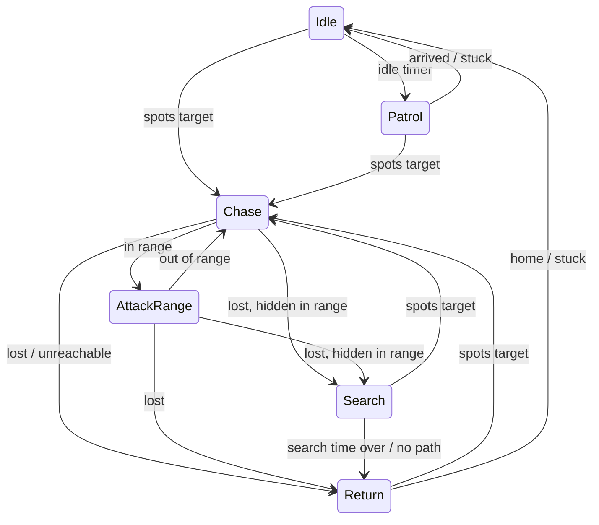
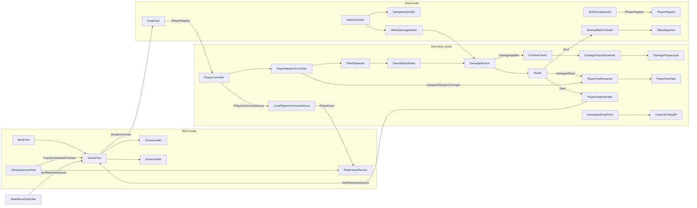

# Architecture

Code map for orienting quickly in the project. One section per system; keep headings stable and update the section that matches the code you change. Conventions and rules live in [CLAUDE.md](../CLAUDE.md); this file describes what exists.

All C# types are in the global namespace (no `namespace` declarations). Paths below are relative to this file.

## Overview

A Unity 6 (URP 2D) top-down action RPG prototype. The player boots into a main menu, starts a new game, and is placed in an area scene (currently the grass "Clearing") where they walk in 8 directions and swing a sword. Weasel mobs idle, patrol around their spawn, spot the player with line-of-sight checks, path around walls on a tilemap grid, crowd around the player without overlapping, and melee attack on a cooldown. Damage shows floating numbers and a HUD health bar. Mobs target whichever registered player they spot (nearest visible), so the code is ready for more than one player. A dead player respawns at the area's spawn point after a delay while a teammate is still alive; when every player is dead at once the current area restarts. A dev-only stress-test area spawns hundreds of mobs on a procedurally generated map to profile AI and pathfinding.

## Packages

Notable entries in [Packages/manifest.json](../Packages/manifest.json):

| Package | Used for |
|---|---|
| `jp.hadashikick.vcontainer` (OpenUPM) | Dependency injection, `LifetimeScope`s, entry points |
| `com.unity.inputsystem` | `InputSystem_Actions.inputactions`, `PlayerInputService`, UI input module |
| `com.unity.render-pipelines.universal` | URP 2D renderer, `Light2D` |
| `com.skner.dualgrid` (git) | `DualGridTilemapModule` for dual-grid terrain rendering |
| `com.unity.2d.tilemap` / `.extras` | Tilemaps for terrain, collision and navigation data |
| `com.unity.2d.aseprite`, `com.unity.2d.animation` | Sprite import and animation |
| `com.unity.ugui` + TextMesh Pro | Menu, HUD, damage popups |
| `com.unity.test-framework` | EditMode and PlayMode tests |
| `com.coplaydev.unity-mcp` (git) | UnityMCP editor automation |

## Assemblies

| Assembly | Folder | References | Notes |
|---|---|---|---|
| `TopDownRPG.Core` | `Assets/Scripts/Core` | VContainer, Unity.InputSystem | Boot, scene flow, input, clock, camera follow, screen fader. Must not reference Gameplay. |
| `TopDownRPG.Gameplay` | `Assets/Scripts` (everything outside `Core` and `Dev`) | Core, VContainer, Unity.InputSystem, Unity.TextMeshPro | AI, navigation, combat, player, UI, effects, world, composition roots. |
| `TopDownRPG.DevTools` | `Assets/Scripts/Dev` | Gameplay, Core, VContainer, skner.DualGrid, Unity.2D.Tilemap.Extras | `defineConstraints: UNITY_EDITOR \|\| DEVELOPMENT_BUILD`; not auto-referenced. |
| `TopDownRPG.Editor` | `Assets/Editor` | Core, Gameplay, VContainer | Editor-only platform. |
| `TopDownRPG.EditModeTests` | `Assets/Tests/Editor` | Gameplay, Core, VContainer, Unity.InputSystem, Unity.TextMeshPro | Editor-only test assembly. |
| `TopDownRPG.PlayModeTests` | `Assets/Tests/PlayMode` | Gameplay, Core, DevTools, VContainer, Unity.TextMeshPro | Needs DevTools for the stress-scene test. |

Dependency direction: `Core <- Gameplay <- DevTools`, with `Editor` and both test assemblies on top. Core and Gameplay each have an `AssemblyInfo.cs` ([Core](../Assets/Scripts/Core/AssemblyInfo.cs), [Gameplay](../Assets/Scripts/AssemblyInfo.cs)) granting `InternalsVisibleTo` to both test assemblies; `internal` members are test seams.

## Scenes and boot flow

### Scenes

| Scene | Role | Key contents |
|---|---|---|
| [Main.unity](../Assets/Scenes/Main.unity) | Persistent root, never unloaded. First scene in the build. | `MainLifetimeScope`, Main Camera (`CameraFollow2D`), `EventSystem`, `TransitionCanvas/Fade` (`ScreenFader`) |
| [MainMenu.unity](../Assets/Scenes/MainMenu.unity) | Title screen, loaded additively. | `MenuLifetimeScope`, `MainMenuCanvas` with `MainMenuController`, New Game and Quit buttons |
| [Gameplay.unity](../Assets/Scenes/Gameplay.unity) | Session scene, loaded additively for a play session. | `GameplayLifetimeScope` (references the `Player` prefab, spawned at runtime), `PlayerHudCanvas` prefab, `DamagePopupCanvas` (`DamagePopupLayer`) |
| [Areas/Area_Clearing.unity](../Assets/Scenes/Areas/Area_Clearing.unity) | Starting area, loaded additively under Gameplay. | `AreaLifetimeScope`, `Grid` with DualGrid grass tilemap + render tilemap + `CollisionTilemap` (Obstacles layer), `NavigationGrid2D`, `NavigationTerrainSource2D`, `SpawnPoint_start`, `MobSpawn_Weasel` (`MobSpawnPoint` for the Weasel prefab), Global Light 2D |
| [Dev/StressTest/Area_StressTest.unity](../Assets/Dev/StressTest/Area_StressTest.unity) | Dev-only area (not in the build list, no `SceneDefinition`). | Same area setup plus `StressTestMap`, `StressTestSpawner`, `StressTestOverlay`, `WallVisualTilemap` |

New areas start from the scene template [AreaTemplate.scenetemplate](../Assets/Settings/AreaTemplate.scenetemplate) ([AreaTemplate.unity](../Assets/Settings/Scenes/AreaTemplate.unity)).

Scene identity is data, not strings: [SceneDefinition](../Assets/Scripts/Core/Scenes/SceneDefinition.cs) assets under `Assets/Data/Scenes` hold a scene GUID + path, and [GameScenes](../Assets/Scripts/Core/Scenes/GameScenes.cs) (`Assets/Data/Scenes/GameScenes.asset`) lists MainMenu, Gameplay, the starting area + spawn id, and the known areas.

### Load hierarchy

```
Main (MainLifetimeScope)
├── MainMenu (MenuLifetimeScope, parent = Main)        -- while in the menu
└── Gameplay (GameplayLifetimeScope, parent = Main)    -- while in a session
    └── Area_* (AreaLifetimeScope, parent = Gameplay)  -- exactly one area at a time
```

### Boot sequence

1. Play (or a build) starts in `Main`. In the editor, [PlayModeBootstrapper](../Assets/Editor/Scenes/PlayModeBootstrapper.cs) forces `playModeStartScene = Main` (toggle: `Tools/TopDownRPG/Boot From Main`) and stores the scenes that were open via [EditorBootRequest](../Assets/Scripts/Core/Scenes/EditorBootRequest.cs) (`SessionState`). Test Runner sessions are detected by their `InitTestScene*` scene and left alone.
2. `MainLifetimeScope` builds; its entry point [BootFlow](../Assets/Scripts/Core/Boot/BootFlow.cs) (`IAsyncStartable`) runs.
3. Editor only: `BootFlow` consumes the boot request. If an area scene (known or any other scene, via `SceneDefinition.CreateTransient`) or Gameplay was open, it calls `GameFlow.StartNewGameAsync(area)`; if only MainMenu was open it shows the menu.
4. Otherwise `GameFlow.ShowMainMenuAsync()`.
5. Menu "New Game" -> `MainMenuController.StartNewGame()` -> `GameFlow.StartNewGameAsync()` (starting area + starting spawn id from `GameScenes`).

### GameFlow

[GameFlow](../Assets/Scripts/Core/Scenes/GameFlow.cs) (singleton in Main scope) owns all scene transitions. Uses [SceneLoader](../Assets/Scripts/Core/Scenes/SceneLoader.cs) (additive load/unload, `Resources.UnloadUnusedAssets`) and [ScreenFader](../Assets/Scripts/Core/UI/ScreenFader.cs).

- Every transition: reject if one is running -> `TransitionStarted` -> fade out -> work -> fade in -> `TransitionFinished`. Cancelled with `Application.exitCancellationToken`.
- `ShowMainMenuAsync`: unload area + gameplay, load MainMenu under Main.
- `StartNewGameAsync(area, spawnId)`: unload menu/area/gameplay, load Gameplay under Main, then load the area.
- `ChangeAreaAsync(area, spawnId)`: unload current area, load new area under the Gameplay scope. Nothing in gameplay calls it yet (tests only).
- Area load: enqueues an [AreaEntryRequest](../Assets/Scripts/Core/Scenes/AreaEntryRequest.cs) into the area scope with `LifetimeScope.Enqueue`, parents via `LifetimeScope.EnqueueParent`, sets the area active, then resolves [IAreaEntry](../Assets/Scripts/Core/Scenes/IAreaEntry.cs) from the area scope and calls `Enter()`.
- State: `IsTransitioning`, `IsInMenu`, `IsInGame`, `CurrentArea`, `AreaScene`.

## Composition / DI

VContainer scopes live one per scene. Each Gameplay-assembly scope logs an error and registers nothing if it has no parent (i.e. the scene was opened without booting through Main).

### MainLifetimeScope ([MainLifetimeScope.cs](../Assets/Scripts/Core/Boot/MainLifetimeScope.cs), Core)

| Registration | Kind |
|---|---|
| `GameScenes` | instance (inspector) |
| `Camera` (main camera), `ScreenFader`, `CameraFollow2D` | components (inspector) |
| `IClock` -> `UnityClock.Shared` | instance |
| `IRandom` -> `new SystemRandom()` (time-seeded) | instance |
| `SceneLoader`, `GameFlow` (gets this scope as `LifetimeScope` parameter) | singletons |
| `PlayerInputService` as `IPlayerInput` + self (gets the `InputActionAsset`) | singleton |
| `GameplayInputGate` | entry point |
| `BootFlow` | entry point |

### MenuLifetimeScope ([MenuLifetimeScope.cs](../Assets/Scripts/Composition/MenuLifetimeScope.cs))

- `MainMenuController` via `RegisterComponentInHierarchy` (injected with `GameFlow`).

### GameplayLifetimeScope ([GameplayLifetimeScope.cs](../Assets/Scripts/Composition/GameplayLifetimeScope.cs))

| Registration | Kind |
|---|---|
| `PlayerRegistry` as `IPlayerRegistry` + self | singleton |
| `LocalPlayerCommandSource`, `ActiveSpawnPoint`, `PlayerRespawner` | singletons |
| `PlayerSpawner` (with the inspector's player prefab and the Gameplay scene as parameters) | singleton |
| `LocalPlayer` -> `PlayerSpawner.SpawnLocalPlayer()` | singleton factory |
| `DamagePopupLayer` | component |
| `GameplaySettings` | instance |
| `PlayerHudView` | component in hierarchy |
| `CombatEvents`, `DamageService`, `SlashSpawner`, `EffectSpawner` | singletons |
| `DamagePopupPresenter`, `GameplayEntryPoint`, `PlayerDeathHandler`, `PlayerHudPresenter` | entry points |
| Build callback: resolves `LocalPlayer` | spawns the local player before entry points start |

[GameplayEntryPoint](../Assets/Scripts/Composition/GameplayEntryPoint.cs): on start points `CameraFollow2D` at the local player and snaps; clears the target on dispose.

### AreaLifetimeScope ([AreaLifetimeScope.cs](../Assets/Scripts/Composition/AreaLifetimeScope.cs))

- `AreaEntry` as `IAreaEntry`, with every `SpawnPoint` in the scene. `AreaEntryRequest` comes from `GameFlow`'s enqueued registration.
- `NavigationGrid2D`: first one found in the area scene via [SceneQuery](../Assets/Scripts/Core/Scenes/SceneQuery.cs). Without one, nothing below is registered, and an error is logged if the area has mob spawn points.
- `AreaMobSpawner` (with every `MobSpawnPoint` and the area scene as parameters), plus a build callback that calls `SpawnAll`.
- Logs an error for every `MobController` placed directly in the area scene: mobs must come from spawn points. Other scene objects needing injection go in the scope's `autoInjectGameObjects` (the stress scene lists its `StressTest` object).

[AreaEntry](../Assets/Scripts/Composition/AreaEntry.cs): finds the `SpawnPoint` whose id matches the request (falls back to the first one with a warning), records it in the Gameplay-scope `ActiveSpawnPoint` for respawns, teleports every registered player to its own slot at that spawn point (`SpawnPoint.GetSlotPosition`, in registry order, players without a `PlayerController` are skipped) and snaps the camera.

### How components get injected

- Plain classes: constructor injection (`GameFlow`, `BootFlow`, presenters, spawners, `AreaEntry`).
- MonoBehaviours: `[Inject] public void Construct(...)`, reached via `InjectGameObject` build callbacks or `IObjectResolver.Instantiate`.

| Component | `Construct` parameters | Injected by |
|---|---|---|
| `PlayerWeaponController` | `SlashSpawner`, `IClock` | `PlayerSpawner` (`resolver.Instantiate`) |
| `MainMenuController` | `GameFlow` | Menu scope |
| `MobController` | `NavigationGrid2D`, `IPlayerRegistry`, `IRandom` | `AreaMobSpawner` or `StressTestSpawner` (`resolver.Instantiate`) |
| `MobMotor2D` | `IClock` | same as `MobController` |
| `MeleeDamageDealer` | `IClock`, `DamageService` | same as `MobController` |
| `DestroyMobOnDeath` | `EffectSpawner` | same as `MobController` |
| `StressTestSpawner` | `IObjectResolver`, `NavigationGrid2D`, `LocalPlayer` | Area scope `autoInjectGameObjects` |

`MeleeDamageDealer`, `MobMotor2D` and `PlayerWeaponController` default their clock to `UnityClock.Shared` when not injected.

## Input

- [IPlayerInput](../Assets/Scripts/Core/Input/IPlayerInput.cs): `Move`, `AttackPressedThisFrame`, `GameplayEnabled`. The local device seam; gameplay reaches it only through `LocalPlayerCommandSource` (see Player).
- [PlayerInputService](../Assets/Scripts/Core/Input/PlayerInputService.cs): wraps the `Player` action map of [InputSystem_Actions.inputactions](../Assets/InputSystem_Actions.inputactions) (`Move`, `Attack` used; the asset also defines Look/Interact/Crouch/Jump/Previous/Next/Sprint). Returns neutral input while the map is disabled. Logs an error if the map/actions are missing.
- [GameplayInputGate](../Assets/Scripts/Core/Input/GameplayInputGate.cs): entry point that enables the Player map only when `GameFlow.IsInGame && !IsTransitioning`; listens to `TransitionStarted`/`TransitionFinished`.
- UI input uses the `UI` map through the `EventSystem` in Main.

## Clock

- [IClock](../Assets/Scripts/Core/Clock/IClock.cs): `float Time`. Used for cooldowns and gameplay timers.
- [UnityClock](../Assets/Scripts/Core/Clock/UnityClock.cs): `Time.time`; `UnityClock.Shared` is registered in the Main scope.
- Clock consumers: `MeleeDamageDealer`, `PlayerWeaponController`, `MobMotor2D` (attack animation window). Mob AI timers are driven by the `dt` passed to `MobController.TickStateMachine`, which tests control. Purely visual, per-client animations (`SwordSlashAttack` lifetime, `MobDeathAnimation`, damage popups) advance with `Time.deltaTime` on purpose.
- [IRandom](../Assets/Scripts/Core/Random/IRandom.cs): `Range(min, max)`, `InsideUnitCircle()`. [SystemRandom](../Assets/Scripts/Core/Random/SystemRandom.cs) wraps `System.Random`, time-seeded or with an explicit seed (tests). Gameplay code never uses `UnityEngine.Random`.
- Randomness consumers: `MobPatrolAnchor` (roam destinations, idle durations via `MobConfig.NextIdleDuration(IRandom)`), passed down from `MobController`.

## Camera and sprite sorting

- [CameraFollow2D](../Assets/Scripts/Core/Camera/CameraFollow2D.cs) (Core, on Main Camera): `LateUpdate` SmoothDamp follow of the target's Rigidbody2D position, separate smooth times for moving/idle, snaps to the pixel grid (32 PPU). `SetTarget`, `SnapToTarget`.
- [YPositionSorter](../Assets/Scripts/Camera/YPositionSorter.cs) (Gameplay, `[ExecuteAlways]`): sets `sortingOrder = offset - round(y * multiplier)` on a `SortingGroup` or on all child renderers (keeping their relative offsets). On the player, Weasel and death-animation prefabs.
- The camera culls the `Obstacles` layer, so collision tilemaps are invisible; visible walls need a separate render tilemap (see `StressTestMap`).

## UI

| Type | Role |
|---|---|
| [ScreenFader](../Assets/Scripts/Core/UI/ScreenFader.cs) | `CanvasGroup` fade used by `GameFlow` (unscaled time); blocks raycasts while visible; starts opaque. |
| [MainMenuController](../Assets/Scripts/UI/MainMenuController.cs) | Button handlers `StartNewGame` / `QuitGame`; selects the first button for gamepad/keyboard navigation. |
| [PlayerHudView](../Assets/Scripts/UI/PlayerHudView.cs) | Passive view on `PlayerHudCanvas`: health fill + "HP n" text, weapon icon with tint when missing. |
| [PlayerHudPresenter](../Assets/Scripts/UI/PlayerHudPresenter.cs) | Entry point; subscribes to the local player's `Health.Damaged`/`Died`/`Restored` and `PlayerWeaponController.EquippedWeaponChanged`, pushes into the view. |

Damage popups are under Combat.

## Player

Prefab: [Player.prefab](../Assets/Prefabs/Player/Player.prefab) (`PlayerController`, `PlayerWeaponController`, `Health`, `DamageReceiver`, `DisableOnDeath`, `YPositionSorter`), referenced by `GameplayLifetimeScope` and spawned at runtime by `PlayerSpawner`.

| Type | Role |
|---|---|
| [PlayerController](../Assets/Scripts/Player/PlayerController.cs) | Reads a `PlayerCommand` from its `IPlayerCommandSource` in `Update` (internal `Tick`), sets `Rigidbody2D.linearVelocity` in `FixedUpdate`, drives animator (`IsMoving`, `MoveX/Y`, `LastMoveX/Y`), forwards attack commands to the weapon controller. No source = idle, with an error logged in `Start`. `SetCommandSource`, `FacingDirection`, `Teleport`, internal `Face` (tests). |
| [PlayerCommand](../Assets/Scripts/Player/PlayerCommand.cs) / [IPlayerCommandSource](../Assets/Scripts/Player/IPlayerCommandSource.cs) | One frame of player intent (`Move`, `Attack`) and where a player gets it from, so each player can be driven independently. |
| [LocalPlayerCommandSource](../Assets/Scripts/Player/LocalPlayerCommandSource.cs) | Wraps `IPlayerInput`; `PlayerSpawner` gives it to the local player only. |
| [PlayerWeaponController](../Assets/Scripts/Player/PlayerWeaponController.cs) | Holds the equipped `PlayerWeapon`; `TryAttack` checks the `IClock` cooldown and spawns a slash in the facing direction via `SlashSpawner`. Event `EquippedWeaponChanged`. |
| [PlayerHandle](../Assets/Scripts/Player/PlayerHandle.cs) | One player as other systems see it: `Transform`, `Health`, `IsAlive`. |
| [IPlayerRegistry](../Assets/Scripts/Player/IPlayerRegistry.cs) / [PlayerRegistry](../Assets/Scripts/Player/PlayerRegistry.cs) | Every player in the session: `Players`, `Contains`, `AnyAlive`, events `PlayerAdded`/`PlayerRemoved`. `Add`/`Remove` (ignore null and duplicates) are on the concrete class only. Used by mobs and death handling. |
| [PlayerSpawner](../Assets/Scripts/Player/PlayerSpawner.cs) | `SpawnLocalPlayer`: instantiates the player prefab through `IObjectResolver` (injecting its components), gives it the `LocalPlayerCommandSource`, moves it into the Gameplay scene so it survives area changes, registers its handle and returns the `LocalPlayer`. |
| [LocalPlayer](../Assets/Scripts/Player/LocalPlayer.cs) | The player this machine controls: `Controller`, `Weapon`, `Handle`, `Transform`. Used by the camera, HUD, `AreaEntry` and the stress spawner. |
| [PlayerDeathHandler](../Assets/Scripts/Player/PlayerDeathHandler.cs) | Entry point; listens to `Health.Died` of every registered player (follows `PlayerAdded`/`PlayerRemoved`). If no registered player is alive (party wipe), waits `GameplaySettings.RestartDelaySeconds`, then `GameFlow.StartNewGameAsync(CurrentArea)` (full session reload = fresh players). Otherwise waits `RespawnDelaySeconds` and asks `PlayerRespawner` to bring the dead player back, unless a party wipe happened in the meantime. |
| [PlayerRespawner](../Assets/Scripts/Player/PlayerRespawner.cs) | `TryRespawn(player)`: only for dead players in the registry; `Health.Restore()` (which re-enables the player through `DisableOnDeath`) and teleports to the player's slot at `ActiveSpawnPoint.Current`, or leaves them in place when there is none. |
| [ActiveSpawnPoint](../Assets/Scripts/World/ActiveSpawnPoint.cs) | The `SpawnPoint` the party last entered the current area through. |

Config: [GameplaySettings](../Assets/Scripts/Composition/GameplaySettings.cs) (`Assets/Data/GameplaySettings.asset`): restart delay (1.5 s), respawn delay (3 s).

## Combat

### Health and damage

| Type | Role |
|---|---|
| [Health](../Assets/Scripts/Combat/Health.cs) | Int HP; `ApplyDamage` clamps, returns applied amount; events `Damaged(Health.DamageEvent)` and `Died(Health)` (once per death). `Restore()` refills to max and raises `Restored(Health)` (no-op at full health); a restored `Health` can die again. |
| [DamageReceiver](../Assets/Scripts/Combat/DamageReceiver.cs) | Marks something as hittable: `FindFor(transform)` walks up parents; exposes its `Health` and `PopupWorldPosition`. Applies nothing itself. |
| [DamageService](../Assets/Scripts/Combat/DamageService.cs) | Gameplay-scope singleton and the only gameplay path that applies damage: `ApplyDamage(receiver, amount, source)` ignores null targets and non-positive amounts, applies to `Health` and publishes a `DamageReport` to `CombatEvents` when damage landed. This is the seam the host will own once networking arrives ([Multiplayer.md](Multiplayer.md)). Tests still call `Health.ApplyDamage` directly to set up state. |
| [DamageReport](../Assets/Scripts/Combat/DamageReport.cs) | Target, amount, source, popup world position. |
| [CombatEvents](../Assets/Scripts/Combat/CombatEvents.cs) | Gameplay-scope event bus: `DamageApplied(DamageReport)`. |
| [MeleeDamageDealer](../Assets/Scripts/Combat/MeleeDamageDealer.cs) | Mob melee: `TryDealDamage(target)` with `IClock` cooldown, through `DamageService` (logs an error and deals nothing without one); damage/interval overwritten from `MobConfig`. |

### Player weapon and slash

| Type | Role |
|---|---|
| [PlayerWeapon](../Assets/Scripts/Combat/PlayerWeapon.cs) | ScriptableObject: name, damage, cooldown, spawn distance, per-direction offsets (Down, Up, Left, Right), slash prefab, HUD icon. Asset: `Assets/Data/Weapons/Sword.asset`. |
| [SlashSpawner](../Assets/Scripts/Combat/SlashSpawner.cs) | Instantiates the weapon's slash prefab through `IObjectResolver` and initializes it with the `DamageService`. |
| [SwordSlashAttack](../Assets/Scripts/Combat/SwordSlashAttack.cs) | Trigger hitbox that follows the owner's sprite, rotates to the attack direction, mirrors when facing east, plays its clip through a `PlayableGraph`, decides which `DamageReceiver`s it hit (each once, never the owner) and applies the damage through `DamageService`, checks initial overlaps, self-destroys after the clip length. Prefab: `Assets/Prefabs/Combat/SwordSlash.prefab`. |

### Death

| Type | Role |
|---|---|
| [DisableOnDeath](../Assets/Scripts/Combat/DisableOnDeath.cs) | Player: on death disables every other enabled MonoBehaviour except `Health`/`DamageReceiver`, then `DeathPhysics.Disable`; on `Health.Restored` re-enables exactly the behaviours and colliders it turned off and restores the Rigidbody2D's `simulated` flag. |
| [DestroyMobOnDeath](../Assets/Scripts/Combat/DestroyMobOnDeath.cs) | Mobs: disables physics, spawns the `MobDeathAnimation` template via `EffectSpawner`, destroys the mob. |
| [DeathPhysics](../Assets/Scripts/Combat/DeathPhysics.cs) | Static helper: disable colliders, zero and unsimulate the Rigidbody2D. |
| [MobDeathAnimation](../Assets/Scripts/Combat/MobDeathAnimation.cs) | Copies the dead mob's sprite renderer settings/scale, plays `MobDeath.anim` via `PlayableGraph`, self-destroys. Prefab: `Assets/Prefabs/Combat/MobDeathAnimation.prefab`. |

### Damage popups

| Type | Role |
|---|---|
| [DamagePopupPresenter](../Assets/Scripts/Combat/DamagePopupPresenter.cs) | Entry point: `CombatEvents.DamageApplied` -> `DamagePopupLayer.Spawn`; `Tick` advances popups, `PostLateTick` re-projects them after the camera moved. |
| [DamagePopupLayer](../Assets/Scripts/Combat/DamagePopupLayer.cs) | On `DamagePopupCanvas`; `ObjectPool<FloatingDamageText>` with prewarm; releases popups past their lifetime. |
| [FloatingDamageText](../Assets/Scripts/Combat/FloatingDamageText.cs) | TMP text that rises and fades; world-to-canvas projection. Prefab: `Assets/Prefabs/UI/DamagePopup.prefab`. |

## Effects

- [EffectSpawner](../Assets/Scripts/Effects/EffectSpawner.cs): `Spawn<T>(template, configure)` instantiates an inactive copy at scene root, runs `configure`, activates it. No pooling. Only user: `DestroyMobOnDeath`.

## Mob AI: components

Prefab: [Weasel.prefab](../Assets/Prefabs/Mobs/Weasel.prefab): `MobController`, `MobMotor2D`, `MobPerception2D`, `MobPathAgent2D`, `MobPatrolAnchor`, `MeleeDamageDealer`, `Health`, `DamageReceiver`, `DestroyMobOnDeath`, `YPositionSorter`; config `Mob_Default`, death template `MobDeathAnimation.prefab`, animator `Weasel.controller`.

| Type | Role |
|---|---|
| [MobController](../Assets/Scripts/AI/Core/MobController.cs) | The brain. Initializes all mob components from `MobConfig`, builds the grid if needed, prewarms regions, creates the six states and `MobSeparation2D`. `Update` -> `TickStateMachine(dt)`; `FixedUpdate` -> `FixedTickStateMachine()`. Exposes components to states, `ChangeState`, attack-range checks (collider distance), `onAttackRangeEntered` UnityEvent, gizmos + state label. `Configure(...)` is a non-DI setup path used by tests. Logs an error in `Start` if it was never given its grid, players and random source. |
| [MobMotor2D](../Assets/Scripts/AI/Core/MobMotor2D.cs) | Rigidbody2D movement: `desiredVelocity` (path) + `steeringVelocity` (separation), clamped to move speed, accelerated with `MoveTowards` in `FixedTick`. Drives animator params incl. optional `IsAttacking` (timed on `IClock`); faces intended direction, not drift. |
| [MobPerception2D](../Assets/Scripts/AI/Core/MobPerception2D.cs) | Picks its target from `IPlayerRegistry`. Range hysteresis (`detectionRadius` to acquire, `loseTargetDistance` to keep), throttled `Physics2D.Linecast` against `obstacleLayerMask`. Keeps its current target while it stays detected; while it is not detected (hidden or outside detection range) it switches to the nearest other alive player inside `detectionRadius` with line of sight. Drops the target when it dies, leaves the registry or goes beyond `loseTargetDistance`. Exposes `CurrentTarget`, `CurrentTargetPlayer`, `HasDetectedTarget`, `HasLineOfSight`, `LastKnownTargetPosition`, `IsTargetHiddenInRange`. |
| [MobPathAgent2D](../Assets/Scripts/AI/Core/MobPathAgent2D.cs) | Requests paths from the grid's `IPathfinder2D`, smooths them, follows waypoints, tracks `StalledTime`. See Navigation. |
| [MobPatrolAnchor](../Assets/Scripts/AI/Core/MobPatrolAnchor.cs) | Remembers spawn position; samples reachable roam destinations within `patrolRoamRadius` and idle durations from the injected `IRandom` (no roaming without one). |
| [MobSeparation2D](../Assets/Scripts/AI/Core/MobSeparation2D.cs) | Plain class for crowd steering. See Crowd separation. |
| [IMobState](../Assets/Scripts/AI/Core/IMobState.cs), [MobStateId](../Assets/Scripts/AI/Core/MobStateId.cs) | State contract (`Enter`/`Tick`/`FixedTick`/`Exit`) and ids. |
| [MobConfig](../Assets/Scripts/AI/Core/MobConfig.cs) | ScriptableObject with movement, perception, search, combat, crowd, patrol and navigation tuning. Assets: `Assets/Settings/AI/Mob_Default.asset`, `Assets/Dev/StressTest/Mob_StressTest.asset`. |

Per-frame order: `Update`: perception tick, then state `Tick` (decisions, repath). `FixedUpdate`: separation sense, state `FixedTick` (path following sets desired velocity), motor applies desired + steering.

## Mob AI: state machine

States are plain classes deriving from [MobStateBase](../Assets/Scripts/AI/StateMachine/MobStateBase.cs), which exposes the brain's components and config. "Spots target" below means `HasDetectedTarget` and `PathAgent.CanReachWorldTarget(target)`.

| State | Enter | Tick transitions | FixedTick |
|---|---|---|---|
| [IdleState](../Assets/Scripts/AI/StateMachine/IdleState.cs) | Clear path, stop, roll idle duration | Spots target -> Chase; timer done -> Patrol | Stop |
| [PatrolRoamState](../Assets/Scripts/AI/StateMachine/PatrolRoamState.cs) | Pick reachable roam point, build path; fail -> Idle | Spots target -> Chase; arrived or stalled `stuckTimeout` -> Idle | Follow path |
| [ChaseState](../Assets/Scripts/AI/StateMachine/ChaseState.cs) | Clear path | Lost target -> Search if hidden within lose range, else Return; in attack range -> AttackRange; every `repathInterval` repath, and unreachable / partial / goal-adjusted -> Return | Wait (stop, face target) if an ally is directly ahead near the target (with release hysteresis), else follow path |
| [AttackRangeState](../Assets/Scripts/AI/StateMachine/AttackRangeState.cs) | Clear path, stop, fire `onAttackRangeEntered`, attack | Lost target -> Search/Return; beyond `attackStopDistance + attackExitBuffer` -> Chase; else face + `TryDealDamage` + attack animation | Stop |
| [SearchState](../Assets/Scripts/AI/StateMachine/SearchState.cs) | Strict path to last known position; fail -> Return | Spots target -> Chase; once arrived or stalled, count down `searchDuration` -> Return | Follow path |
| [ReturnToSpawnState](../Assets/Scripts/AI/StateMachine/ReturnToSpawnState.cs) | Resolve spawn cell (or nearest walkable), build path; fail -> Idle | Spots target -> Chase; in spawn cell, arrived or stalled -> Idle | Follow path |



## Crowd separation

[MobSeparation2D](../Assets/Scripts/AI/Core/MobSeparation2D.cs), owned by each `MobController`:

- `Sense(position)` each fixed tick: `Physics2D.OverlapCircle` (non-allocating, `ContactFilter2D` on the mob's own layer, no triggers) within `separationRadius * SenseRadiusFactor`; push away from neighbours closer than `separationRadius`, weighted by overlap; exactly coincident mobs get opposite deterministic directions from instance ids.
- Velocity = push * `separationStrength`, clamped per axis so it never points into an unwalkable cell (look-ahead on the nav grid).
- `HasNeighborToward(target, maxDistance)`: used by `ChaseState` to wait behind allies within `crowdWaitDistance` of the target instead of pushing into them.
- The motor adds this steering velocity to the path velocity.

Config: `MobConfig` Crowd header (`separationRadius`, `separationStrength`, `crowdWaitDistance`).

## Navigation and pathfinding

| Type | Role |
|---|---|
| [NavigationGrid2D](../Assets/Scripts/AI/Navigation/NavigationGrid2D.cs) | Area-scene MonoBehaviour. `BuildGrid` (in `Awake`) collects cells from each terrain source: data-tilemap cells minus collision-tilemap cells, tagged with the source's `TerrainType2D`. Walkability/cost per `TerrainMovementProfile2D` (overlapping terrains: most restrictive walkability, highest cost). World/cell conversion, 8-neighbours without corner cutting, octile heuristic, Bresenham line cost, nearest-walkable search, connected-region labeling (4-connected flood fill cached per profile + profile version) for O(1) `AreCellsConnected`. Owns the `GridAStarPathfinder2D`. |
| [NavigationTerrainSource2D](../Assets/Scripts/AI/Navigation/NavigationTerrainSource2D.cs) | Binds a data tilemap, optional collision tilemap, render tilemap and a `TerrainType2D`. |
| [IPathfinder2D](../Assets/Scripts/AI/Navigation/IPathfinder2D.cs) | `FindPath(request[, cellsBuffer])`. |
| [GridAStarPathfinder2D](../Assets/Scripts/AI/Navigation/GridAStarPathfinder2D.cs) | A* with a binary heap and reused node dictionary (no allocations once warm). Strict requests fail fast when the goal is unwalkable or in another region. Partial requests adjust an unwalkable goal to the nearest walkable cell, and toward an unreachable goal return the path to the closest expanded cell, capped by `maxSearchCells`. `ProfilerMarker` `GridAStarPathfinder2D.FindPath`. |
| [PathTypes.cs](../Assets/Scripts/AI/Navigation/PathTypes.cs) | `PathRequest` (start, goal, allowPartial, profile), `PathResult` (success, partial, goal adjusted, reached resolved goal, cells). |
| [TerrainType2D](../Assets/Scripts/AI/Navigation/TerrainType2D.cs) | Terrain tag asset (`Assets/Settings/AI/Terrain_Grass.asset`). |
| [TerrainMovementProfile2D](../Assets/Scripts/AI/Navigation/TerrainMovementProfile2D.cs) | Per-mob rules: default walkable/cost + per-terrain rules; `Version` bumps on change so region caches refresh. Asset: `Assets/Settings/AI/TerrainMovement_Default.asset`. |

Path agent flow ([MobPathAgent2D](../Assets/Scripts/AI/Core/MobPathAgent2D.cs)): world goal -> cells -> `FindPath` into a reused buffer -> smooth (skip intermediate cells only when the straight line is traversable and no more expensive than the route) -> waypoints (last one is the exact goal unless partial) -> `FixedTick` steers toward the next waypoint, using `arrivalDistance` for the final one. `CanReachWorldTarget` = goal walkable + same region. `ProfilerMarker` `MobPathAgent2D.BuildPathToWorld`.

Costs: 10 per straight step by default, diagonals x1.4.

## World and areas

- Areas are separate scenes with a `Grid`, a DualGrid terrain tilemap (`DualGridTilemapModule` data + render tilemaps), a `CollisionTilemap` on the `Obstacles` layer, `NavigationGrid2D` + `NavigationTerrainSource2D`, one or more [SpawnPoint](../Assets/Scripts/World/SpawnPoint.cs)s (string `spawnId`, `partySpacing`, `GetSlotPosition(index)`: slot 0 on the point, then alternating right/left, gizmo), [MobSpawnPoint](../Assets/Scripts/World/MobSpawnPoint.cs)s (mob prefab, gizmo) and an `AreaLifetimeScope`.
- [AreaMobSpawner](../Assets/Scripts/World/AreaMobSpawner.cs): `SpawnAll` instantiates each spawn point's mob prefab through the area container at the point's position and moves it into the area scene; spawn points without a prefab log an error. Mobs are never placed in area scenes directly.
- Project layers include `Obstacles` (collision tilemaps; `MobConfig.obstacleLayerMask` uses it for line of sight), `Player` and `Enemy`. Separation only senses colliders on the mob's own layer.
- Adding an area: create from the area template, add a `SceneDefinition`, list it in `GameScenes.areas`, enable it in build settings (enforced by `SceneBuildValidator`).

## Dev tools (stress test)

Assembly `TopDownRPG.DevTools`, scene `Area_StressTest.unity`, mob variant `Weasel_StressTest.prefab` using `Mob_StressTest` (zero attack damage).

| Type | Role |
|---|---|
| [StressTestMap](../Assets/Scripts/Dev/StressTest/StressTestMap.cs) | `[DefaultExecutionOrder(-1000)]`; in `Awake` generates a seeded map (Open / Scattered / Corridors walls), paints DualGrid ground, walls and a render-only wall copy, then rebuilds the `NavigationGrid2D`. |
| [StressTestSpawner](../Assets/Scripts/Dev/StressTest/StressTestSpawner.cs) | Seeded spawner using `resolver.Instantiate` on reachable cells near the player or across the map; `Mobs`, `MobCount`, `ClearMobs`. |
| [StressTestOverlay](../Assets/Scripts/Dev/StressTest/StressTestOverlay.cs) | IMGUI overlay: FPS, mob counts per state, `ProfilerRecorder` stats for FindPath/BuildPath and GC alloc per frame, spawn/clear buttons. |

Play it by opening `Area_StressTest.unity` and pressing Play (Boot From Main loads it as a transient area).

## Editor tools

Menu root: `Tools/TopDownRPG/`.

| Type | Role |
|---|---|
| [PlayModeBootstrapper](../Assets/Editor/Scenes/PlayModeBootstrapper.cs) | Boot From Main toggle (EditorPrefs), saves modified scenes before Play, records open scenes as an `EditorBootRequest`, skips Test Runner sessions. |
| [ProjectScenes](../Assets/Editor/Scenes/ProjectScenes.cs) | Constants for Main scene path, GameScenes asset path, menu root. |
| [SceneSetMenu](../Assets/Editor/Scenes/SceneSetMenu.cs) | `Open Scenes/` menu: Main; Main + Main Menu; Main + Gameplay + Starting Area. |
| [SceneBuildValidator](../Assets/Editor/Scenes/SceneBuildValidator.cs) | Pre-build check (and `Validate Build Scenes` menu): Main first in build list, every `SceneDefinition` assigned and enabled in the build. |
| [SceneDefinitionEditor.cs](../Assets/Editor/Scenes/SceneDefinitionEditor.cs) | Inspector with a `SceneAsset` picker + build-list warning; also contains `SceneDefinitionPathSync` (`AssetPostprocessor` refreshing paths when scenes move). |
| [PlayerSlashPrefabBootstrap](../Assets/Editor/Combat/PlayerSlashPrefabBootstrap.cs) | On editor load, (re)creates `SwordSlash.prefab` if missing/invalid and links it into `Sword.asset`; menu `Rebuild Player Slash Prefab`. |
| [VContainerDiagnosticsBuildGuard](../Assets/Editor/VContainerDiagnosticsBuildGuard.cs) | Turns off VContainer diagnostics for non-development builds and restores it afterwards. |
| [PixelArtTextureDefaults](../Assets/Editor/PixelArtTextureDefaults.cs) | `AssetPostprocessor` for `Assets/Sprites/`: sprite, 32 PPU, point filter, no mips, uncompressed RGBA32; menu `Tools/Textures/Apply Pixel Art Defaults To Sprites`. |
| [PixelArtEditorSnapSettings](../Assets/Editor/PixelArtEditorSnapSettings.cs) | Sets editor move snap to 1/32; menu `Tools/Pixel Art/Apply Move Snap (1/32)`. |

## ScriptableObject configs

| Type | Assets | Consumed by |
|---|---|---|
| `GameScenes` | `Assets/Data/Scenes/GameScenes.asset` | `MainLifetimeScope`, `GameFlow`, `BootFlow`, editor scene tools |
| `SceneDefinition` | `Assets/Data/Scenes/Scene_*.asset` | `GameScenes`, `GameFlow`, `SceneLoader` |
| `GameplaySettings` | `Assets/Data/GameplaySettings.asset` | `PlayerDeathHandler` (restart and respawn delays) |
| `PlayerWeapon` | `Assets/Data/Weapons/Sword.asset` | `PlayerWeaponController`, `SlashSpawner`, `SwordSlashAttack`, HUD |
| `MobConfig` | `Assets/Settings/AI/Mob_Default.asset`, `Assets/Dev/StressTest/Mob_StressTest.asset` | All mob components and states |
| `TerrainMovementProfile2D` | `Assets/Settings/AI/TerrainMovement_Default.asset` | `MobConfig.movementProfile` -> navigation |
| `TerrainType2D` | `Assets/Settings/AI/Terrain_Grass.asset` | `NavigationTerrainSource2D`, profiles |

## Cross-system interactions



Events summary:

| Event | Publisher | Subscribers |
|---|---|---|
| `GameFlow.TransitionStarted` / `TransitionFinished` | `GameFlow` | `GameplayInputGate` |
| `Health.Damaged` | `Health` | `PlayerHudPresenter` |
| `Health.Died` | `Health` | `PlayerHudPresenter`, `PlayerDeathHandler`, `DisableOnDeath`, `DestroyMobOnDeath` |
| `Health.Restored` | `Health.Restore` (via `PlayerRespawner`) | `PlayerHudPresenter`, `DisableOnDeath` |
| `CombatEvents.DamageApplied` | `DamageService` | `DamagePopupPresenter` |
| `PlayerRegistry.PlayerAdded` / `PlayerRemoved` | `PlayerRegistry` | `PlayerDeathHandler` |
| `PlayerWeaponController.EquippedWeaponChanged` | `PlayerWeaponController` | `PlayerHudPresenter` |
| `MobController.onAttackRangeEntered` (UnityEvent) | `AttackRangeState` | inspector listeners (none on Weasel) |

## Tests

Run through UnityMCP `run_tests` (see CLAUDE.md). Tests build their own grids, tilemaps and GameObjects and destroy them in `TearDown`.

### EditMode (`Assets/Tests/Editor`)

| File | Covers |
|---|---|
| [AreaEntryTests.cs](../Assets/Tests/Editor/AreaEntryTests.cs) | Spawn point slots, every registered player placed in its own slot at the requested spawn (and recorded as the active spawn point), `PlayerRespawner` rules and placement |
| [AreaMobSpawnerTests.cs](../Assets/Tests/Editor/AreaMobSpawnerTests.cs) | Spawn points without a prefab log an error and spawn nothing |
| [CombatComponentTests.cs](../Assets/Tests/Editor/CombatComponentTests.cs) | `Health` clamping/single death, `Restore`, `DamageService` publishing and invalid hits, `MeleeDamageDealer` cooldown, receiver lookup and missing `DamageService`, `DamagePopupLayer` projection and pooling, `DamagePopupPresenter` subscription lifetime |
| [MobMotor2DTests.cs](../Assets/Tests/Editor/MobMotor2DTests.cs) | Attack animation flag and its end on the injected clock, no allocation, controller change, facing vs steering drift |
| [MobPathAgent2DTests.cs](../Assets/Tests/Editor/MobPathAgent2DTests.cs) | Arrival distance, smoothing respects terrain cost, no allocation when warm, stall tracking |
| [MobStateMachineTests.cs](../Assets/Tests/Editor/MobStateMachineTests.cs) | All state transitions, reinjection, region prewarm, search timing, unreachable/off-grid/dead targets, attack cooldown, patrol reachability, separation (push apart, coincident, never into walls), chase crowd waiting, multi-player targeting (nearest visible, sticky target, switch on death or hiding, drop on registry removal) |
| [NavigationGridPathfindingTests.cs](../Assets/Tests/Editor/NavigationGridPathfindingTests.cs) | A* shortest/partial/strict paths, allocation, search cap, corner cutting, terrain profiles and costs, overlapping sources, region connectivity vs A* on random grids |
| [PathfindingBenchmarkTests.cs](../Assets/Tests/Editor/PathfindingBenchmarkTests.cs) | `[Explicit, Category("Benchmark")]` timing runs, logged with a `[PathBench]` prefix; run by name |
| [SystemRandomTests.cs](../Assets/Tests/Editor/SystemRandomTests.cs) | Range bounds, unit circle, same seed same sequence |
| [PlayerRegistryTests.cs](../Assets/Tests/Editor/PlayerRegistryTests.cs) | Add/remove events, null and duplicate handling, `AnyAlive` |
| [PlayerInputServiceTests.cs](../Assets/Tests/Editor/PlayerInputServiceTests.cs) | Map enable/disable, neutral input when disabled, dispose |
| [PlayerWeaponSystemTests.cs](../Assets/Tests/Editor/PlayerWeaponSystemTests.cs) | Equip + HUD icon, HUD presenter, attack cooldown/facing, `PlayerController` driven by a command source (facing, attack, idle without one), `LocalPlayerCommandSource`, slash hit rules/follow/offsets/mirroring/opening sprite, input asset Attack binding, Main scope input asset wiring |

Fakes and seams:
- [ManualClock](../Assets/Tests/Editor/ManualClock.cs): `IClock` with settable `Time` and `Advance`.
- `SystemRandom` with a fixed seed stands in for `IRandom`.
- A real `PlayerRegistry` of `PlayerHandle`s over test transforms stands in for the session players.
- Mobs are driven manually: `MobController.Configure`/`Construct`, then `TickStateMachine(dt)` / `FixedTickStateMachine()`.
- `internal` hooks via `InternalsVisibleTo`: `DamagePopupLayer.Configure`/`ActiveCount`, `PlayerHudView.ConfigureReferences`, `FloatingDamageText.Advance`/`Refresh`, `SwordSlashAttack.Tick`, `PlayerController.Face`/`Tick`, `MobMotor2D` attack/facing state and `UpdateAttackAnimation`, `MobPathAgent2D.Waypoints`, `GridAStarPathfinder2D.LastExpandedCount`, `NavigationGrid2D.AreRegionsLabeled`.

### PlayMode (`Assets/Tests/PlayMode`)

| File | Covers |
|---|---|
| [SceneBootTestHelper.cs](../Assets/Tests/PlayMode/SceneBootTestHelper.cs) | Helper: boots through `Main` like a build using `EditorBootRequest`, resolves services from `MainLifetimeScope`, timeout-guarded waits |
| [SceneFlowPlayModeTests.cs](../Assets/Tests/PlayMode/SceneFlowPlayModeTests.cs) | Boot composition (single camera/listener/EventSystem, one spawned player in the Gameplay scene and registry), `ChangeAreaAsync` placement, menu round trip, death restart, respawn at the spawn point while a teammate lives, restart only on a full party wipe, menu boot focus |
| [MobPlayModeBehaviorTests.cs](../Assets/Tests/PlayMode/MobPlayModeBehaviorTests.cs) | Clearing mobs spawned from spawn points into the area scene, detection/loss in the Clearing, shared grid/player injection, attack + popup, attack interval, player death disengagement, mob death animation, HUD + slash damage |
| [StressTestScenePlayModeTests.cs](../Assets/Tests/PlayMode/StressTestScenePlayModeTests.cs) | Stress area boots, spawns its initial mobs and they engage |

## Known gaps and oddities

Factual observations against CLAUDE.md; nothing here has been changed.

- **Inline comments** (CLAUDE.md allows only XML doc summaries): `MobConfig.cs`, `IClock.cs`, `SceneDefinition.cs`, the editor scene tools (`PlayModeBootstrapper`, `SceneBuildValidator`, `SceneDefinitionEditor`, `SceneSetMenu`), `VContainerDiagnosticsBuildGuard`, and several test files.
- **`MobConfig` uses public fields** instead of `[SerializeField] private` + properties, and defaults `obstacleLayerMask` to a hard-coded `1 << 8`. Its create-menu path is `AI/...` while other assets use `TopDownRPG/...` (same for `TerrainType2D`/`TerrainMovementProfile2D`).
- **Mob config assets lag the class**: `Mob_Default.asset` has no serialized values for `searchDuration`, the Crowd fields or `stuckTimeout`, and `Mob_StressTest.asset` none for `searchDuration` or the Crowd fields, so those run on the C# defaults until the assets are re-saved.
- **No pooling for slashes or death effects**: `SlashSpawner` and `EffectSpawner` instantiate, and `SwordSlashAttack`/`MobDeathAnimation` destroy themselves. Only damage popups are pooled.
- **Allocating calls per attack**: `SwordSlashAttack` uses `Physics2D.OverlapBoxAll` and `GetComponentsInChildren<Collider2D>` on every slash.
- **`?.`/`??` on Unity objects**: `referenceTilemap ??= dataTilemap` (`NavigationGrid2D`), `FindArea(...) ?? CreateTransient(...)` (`BootFlow`).
- **Static mutable state**: `SceneQuery` shares a static root-object buffer. `UnityClock.Shared` is a static used as a fallback clock inside components.
- **Two classes in one file**: `SceneDefinitionEditor.cs` also defines `SceneDefinitionPathSync`.
- **No in-game area transitions**: `GameFlow.ChangeAreaAsync` exists and is tested, but nothing in gameplay (doors, triggers) calls it. `GameScenes.areas` holds only the Clearing.
- **A party wipe restarts the whole session**: it reloads Gameplay + area rather than resetting the area in place.
- **Unused or test-only API**: `NavigationGrid2D.GetNeighbors4` (both overloads), the `IEnumerable` `GetNeighbors8` overloads and `HasLineOfSightCells`; `NavigationTerrainSource2D.RenderTilemap`/`IsConfigured`; `TerrainType2D.TerrainId`; `YPositionSorter.SetSortingOrderOffset`/`SetSortingReferenceY`/`ClearSortingReferenceY`; `ScreenFader.IsOpaque`; `PlayerWeaponController.CurrentWeaponName` (tests only); `MobController.onAttackRangeEntered` has no listeners on the Weasel prefab.
- **Duplicated tuning**: `nearestCellSearchRadius` exists on both `NavigationGrid2D` (used when no radius is passed, e.g. inside A*) and `MobConfig`. `MobMotor2D` speed/acceleration, `MeleeDamageDealer` damage/interval and `SwordSlashAttack.damageAmount` are serialized but overwritten at runtime by `MobConfig`/`PlayerWeapon`.
- **Magic numbers**: `MobDeathAnimation` scales the effect by a hard-coded `1.2`; the `StressTestSpawner` tooltip hard-codes "Detection radius is 6".
- **Editor asset writes on load**: `PlayerSlashPrefabBootstrap` can regenerate `SwordSlash.prefab` and rewrite `Sword.asset` from an `[InitializeOnLoad]` delay call.
- **Folder naming**: `YPositionSorter` lives under `Assets/Scripts/Camera` although it handles sprite sorting; the camera follow script is in `Core/Camera`.
