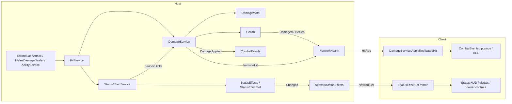

# Damage and status effects

Spec for typed damage, resistances, immunities and status effects (buffs, debuffs, damage over time, crowd control) on every unit: players and mobs. [Architecture.md](Architecture.md) describes what exists today; this file describes the target and the order in which to build it. Tick off the phase checklist as steps land, and move each settled behaviour into Architecture.md as its code arrives.

Every rule in [Multiplayer.md](Multiplayer.md#rules-for-new-code-starting-now) applies: nothing here may assume one player, the host decides every outcome, and each step is checked with a host and 2–4 players.

## Where we start

- `Health` holds integer HP (players and Weasels have 10, the sword hits for 2, the Weasel for 1). `DamageService.ApplyDamage(receiver, amount, source)` is the only gameplay path that changes HP, and it acts only where `IGameAuthority.IsAuthoritative`.
- Damage has no type, nothing reduces it, and nothing checks teams: the sword slash skips only its owner.
- Three things deal damage: `SwordSlashAttack` (weapon damage), `MeleeDamageDealer` (`MobConfig.attackDamage`) and, later, `AbilityService` (blanks for now).
- `NetworkHealth` replicates HP and replays each hit on clients as `DamagedRpc(amount, healthAfter)`, which drives popups and the HUD.
- There is no healing besides `Health.Restore()` on respawn, and no status effects.

## Goals

- Any unit can deal and receive damage through one pipeline, whatever the source: weapon swings, mob attacks, abilities, and damage over time.
- Damage has a type. Each unit has resistances per type (which can be negative, meaning a weakness) and can be immune to some types.
- Units can carry status effects: timed buffs and debuffs that deal or heal over time, change stats (move speed, damage dealt, damage taken, resistances), grant immunities, or restrict actions (stun, root, silence).
- Units can be immune to kinds of status effects (a boss that cannot be stunned).
- Everything is decided on the host and shown on every machine, including late joiners.

## Non-goals (for now)

- Critical hits, dodge or block chances, armour penetration, damage shields, lifesteal.
- Application chances, and resistances that shorten durations. A status either lands or is blocked by an immunity.
- Diminishing returns on crowd control.
- Auras and permanent passives (statuses without a duration).
- Persisting statuses in the save file.
- Real ability effects beyond what Phase 5 needs to exercise the system (see [PlayerControls.md](PlayerControls.md#later)).

## Decisions

| Topic | Decision |
|---|---|
| HP and damage | Stay integers. Every HP and damage value is scaled ×10 first (HP 100, sword 20, Weasel 10) so percentage resistances and multipliers have room to matter. |
| Damage types | A fixed enum: `Physical`, `Fire`, `Frost`, `Lightning`, `Poison`, `True`. Append-only, because assets serialize the value. `True` ignores resistances but not immunities. |
| Resistances | A percentage per damage type. Positive reduces damage, negative increases it. The effective value (base plus statuses) is clamped to [-100%, +80%]: weaknesses can at most double damage, and stacking resistance never reaches immunity. |
| Immunities | Separate from resistance and binary. A unit is immune to a set of damage types (the hit deals 0 and shows "Immune") and to a set of status tags (the status does not land and shows "Immune"). |
| Rounding | The final amount is rounded half away from zero, with a minimum of 1 for any hit that is not immune. |
| Teams | Hostile effects (damage, debuffs) only land on the other faction; helpful effects (heals, buffs) only on the same faction. The services enforce it, so friendly fire is off. A unit without a profile, or a source that is not a unit, has no faction and is exempt from both rules. This answers the friendly fire question in Multiplayer.md. |
| Stacking | Per status: `Refresh` (one instance, reapplying resets its duration), `AddStack` (one instance with a stack count up to a maximum, each application adds a stack and resets the duration) or `Independent` (each application is its own instance with its own timer, up to a maximum; at the cap the instance closest to expiring is replaced). Two different status assets never interact, so "Slow I" and "Slow II" both apply. |
| Damage over time | Ticks every interval after it lands (not on landing), and on the expiry instant when the duration is a multiple of the interval (3 s at 1 s per tick deals 3 ticks). Reapplying never resets the tick phase, so spamming a refresh cannot stall ticks. The source's damage-dealt multiplier is captured when the status lands, so ticks keep working after the source dies or despawns. The target's resistances apply at each tick. |
| Crowd control | Stun: no movement, auto attacks or casts, and it ends any running cast and every order. Root: no movement, but the current order is kept and resumes when the root ends; attacks and casts in range still happen. Silence: no casts, and it ends a running cast; movement and auto attacks continue. Slow is a move speed multiplier, not a control flag. |
| Interrupted casts | An ended cast keeps its cooldown spent. |
| Death | A death clears every status on the unit. A respawn starts clean. |
| Area changes | Statuses survive area changes. Game time stops instead: each machine sets `Time.timeScale` to 0 from `GameFlow.TransitionStarted` to `TransitionFinished`, so nothing ticks, moves or expires behind the fade (statuses, cooldowns, mob AI, physics, respawn delays). The fader already runs on unscaled time. |
| Loading clients | Each machine freezes only during its own transition, so the host can finish loading before a client. On the host, a client's player stays frozen for statuses until that client reports ready for the current area: its statuses neither tick nor run down. |
| Authority | The host applies, ticks, expires and removes every status, and resolves every hit. Clients mirror the replicated state. The owner of a player applies its own replicated slows and controls to its movement and orders, as it already owns that movement. |
| Trust | Unchanged co-op trust: the host does not re-check a client's swings or casts against its own stun or silence state. A swing sent just before a stun reached the client still counts. |
| Healing | A heal goes through `DamageService` like damage (it is the only HP path), cannot exceed max HP and never revives a dead unit (that stays `Health.Restore`). |
| Wire format | A status is identified on the wire by its index in one `StatusEffectCatalog` asset. This is safe because join approval already refuses clients on another build version. |

## Behaviour

### Resolving a hit

Applied on the host in this order:

1. Reject: no target, a dead target, a non-positive amount, the same faction (hostile hits), or no authority.
2. Immunity: if the target is immune to the damage type, the hit deals 0 and is reported as `Immune`. On-hit statuses still go through their own immunity check.
3. Amount: `raw × dealt × (1 − resistance / 100) × taken`, where
   - `dealt` is the product of the source's damage-dealt multipliers (captured at landing for damage over time),
   - `resistance` is the target's base resistance for the type plus every status delta, clamped to [-100, 80], and 0 for `True` damage,
   - `taken` is the product of the target's damage-taken multipliers.
4. Rounding and floor: round half away from zero, minimum 1.
5. Apply to `Health` and report: target, source, type, the HP actually lost, and flags (`Immune`, `Resisted` when resistance was above 0, `Weakness` when below 0, `Periodic` for damage over time).
6. On-hit statuses: applied after the damage, and only if the target survived, so a debuff that raises damage taken does not amplify the hit that carried it. Periodic hits never carry on-hit statuses.

Worked example: a 20 Fire hit from a source under a +25% damage buff, on a Weasel with 50% Fire resistance and a 20% "Vulnerable" debuff: 20 × 1.25 × 0.5 × 1.2 = 15.

### Status effects

Each status is a ScriptableObject:

| Field | Meaning |
|---|---|
| Display name, icon, description | HUD and tooltips |
| Kind | `Buff` (helpful, lands on allies) or `Debuff` (hostile, lands on enemies) |
| Tags | Flags used by immunities: `Stun`, `Root`, `Silence`, `Slow`, `Burn`, `Chill`, `Poison`, `Bleed` (append-only) |
| Duration | Seconds, above 0 |
| Stacking, max stacks | See Decisions |
| Periodic | `None`, `Damage` (amount per tick and damage type) or `Heal` (amount per tick), with a tick interval |
| Move speed multiplier | 1 = unchanged; a slow uses less than 1 |
| Damage dealt multiplier, damage taken multiplier | 1 = unchanged |
| Resistance deltas | Percentage points per damage type, added to the unit's base |
| Grants damage immunity | Damage types the unit becomes immune to |
| Grants status immunity | Tags the unit becomes immune to. Landing it removes active statuses with those tags ("Unstoppable" removes an active stun). |
| Controls | `Stun`, `Root`, `Silence` |
| Visual | Optional looping effect prefab attached to the unit while the status is active |

Stacks scale the effect: periodic amounts and resistance deltas multiply by the stack count, multipliers are raised to its power (two stacks of a 0.8 slow give 0.64). Controls and immunities do not scale.

The unit's combined values are recomputed only when its set of statuses changes (landed, stacked, refreshed, expired, removed), never per frame:

| Combined value | How |
|---|---|
| Move speed, damage dealt, damage taken | Product of every status multiplier, never below 0 |
| Resistances | Base plus the sum of deltas, clamped when a hit is resolved |
| Damage and status immunities | Base (from the unit's profile) OR every granted set |
| Controls | OR of every status's controls |

Applying a status reports one outcome: `Landed`, `Refreshed`, `Stacked`, `Immune`, `WrongFaction`, `TargetDead` or `NoAuthority`.

### Units

Each unit gets a combat profile asset with its base resistances per damage type, its damage immunities and its status immunity tags, plus its faction (`Players` or `Mobs`). A unit without a profile has no resistances and no immunities. Mob variants with different resistances are prefab variants pointing at different profiles.

Sources say what they deal through a `Hit`: amount, damage type and the statuses it applies. The sword and the Weasel deal `Physical` and apply nothing until content says otherwise.

### Crowd control on players (owner machine)

- Stun starts: `PlayerOrders.Clear` (as on death), the motor stops, and new commands are ignored until it ends. The player is Idle afterwards.
- Silence starts: a running cast ends, the buffered cast is dropped and the paused order resumes. Cast attempts fail with a new `CastOutcome.Silenced` (and `Stunned` while stunned), which flashes the slot like any failure.
- Root: the motor holds still while Move, Attack and CastWhenInRange orders keep their targets; stall time does not grow (the path follower is ticked at the scaled speed of 0), so a rooted move never ends as stuck. Casts with `CastMovement.Ability` fail with `Rooted`.
- Slow: `PlayerMotor2D` multiplies `PlayerControlSettings.MoveSpeed` by the combined move speed multiplier.

### Crowd control on mobs (host)

- Stun: `MobController` stops the motor and skips the state tick while stunned; the state machine resumes in the same state.
- Root: states tick, but path following yields no velocity; a mob in attack range keeps attacking.
- Slow: `MobMotor2D` multiplies its move speed.
- States read the controls through the brain, like their other inputs, so they stay free of engine lookups.

## Architecture

New code follows the existing layout: decisions in plain C# classes driven by `IClock` so EditMode tests cover them with fakes, thin MonoBehaviours around them, and one Gameplay-scope service per kind of state change, acting only where `IGameAuthority.IsAuthoritative`.

### Types

| Piece | Kind | Role |
|---|---|---|
| `DamageType`, `DamageTypeMask` | Enums | The types above, and a flags set of them for immunities |
| `StatusTags`, `StatusControls` | Flags enums | Status tags for immunities; `Stun`, `Root`, `Silence` |
| `Faction` | Enum | `None` (a unit without a profile, or a source without a receiver: takes part in neither faction rule), `Players`, `Mobs` |
| `Hit` | Serializable struct | Amount, damage type, statuses to apply. Arrives with statuses in Phase 2; until then `PlayerWeapon` and `MobConfig` only gain a damage type next to their existing `damage`/`attackDamage` fields, so serialized data survives. Used later by abilities |
| `CombatProfile` | ScriptableObject | Faction, base resistances, damage immunities, status immunity tags. Assets `Assets/Data/Combat/Profile_Player.asset`, `Profile_Weasel.asset` |
| `CombatSettings` | ScriptableObject | Resistance floor and cap, minimum damage, per-type popup colours, the status catalog. Asset `Assets/Data/Combat/CombatSettings.asset`, registered in the Gameplay scope |
| `DamageMath` | Static, pure | `Resolve(raw, type, dealt, DefenseSnapshot, CombatSettings)` returning a `DamageResult`. All the arithmetic of "Resolving a hit", nothing else |
| `DefenseSnapshot` | Struct | A unit's effective resistances, immunities and damage-taken multiplier at one moment |
| `DamageResult` | Struct | Type, raw and final amounts, flags |
| `StatusEffectDefinition` | ScriptableObject | The fields in the Status effects table. Assets in `Assets/Data/StatusEffects` |
| `StatusEffectCatalog` | ScriptableObject | Every status definition, in a fixed order; index to definition and back. Can merge into the content catalog for classes and weapons when that exists |
| `StatusEffectSet` | Plain class | One unit's active instances: `Apply` (with the unit's base status immunities), `Remove`, `Clear`, `Tick(deltaTime, dueTicks)` adding due periodic ticks to a caller-owned buffer and removing expired instances, the combined values, and a `Changed` event. Timers count remaining seconds down by the delta the service passes in (taken from `IClock`), so one unit can be held frozen by passing nothing. No engine lookups; no allocation once warm. On clients it is rebuilt from replicated entries with `SyncFrom` and never ticks. |
| `StatusEffects` | Component | On players and mobs next to `Health`. Owns the set and exposes `Changed`, `Blocked`, the damage multipliers and whether the unit is held (`IStatusHold`, set by `NetworkStatusEffects`). Needs no injection: `DamageReceiver` finds it to combine statuses into `GetDefense` and `DamageDealtMultiplier`, and the service tracks units as statuses land on them. Phase 3 adds controls and move speed |
| `NetworkStatusEffects` | NetworkBehaviour | Host: rewrites a server-only `NetworkList<StatusEntry>` (catalog index, instance id, stacks, remaining seconds when written, and the server time of the write) whenever the set changes, forwards blocked statuses as `BlockedRpc`, and is the unit's `IStatusHold`: a player owned by a client that is not ready for the current area is held. Remaining time rather than an end timestamp, because each machine's game clock stops during its own transitions; a client subtracts the server time elapsed since the write. Clients: rebuild their mirror set from the list on spawn and once per frame after changes, which raises the same `Changed` event for HUD and visuals |

Existing types that change:

| Piece | Change |
|---|---|
| `DamageReceiver` | Gains its `CombatProfile` reference, `Faction`, `GetDefense(type)`, and an `ImmuneHit(type, flags)` event raised by `DamageService` for hits it was immune to (they change no HP, so `Health` raises nothing) |
| `Health` | `ApplyDamage` takes the type and flags, which `DamageEvent` carries. Gains `Heal(amount)` and a `Healed` event |
| `DamageService` | `ApplyDamage(receiver, amount, type, source, flags)` resolves through `DamageMath` with the target's `Defense` and the source's damage-dealt multiplier; `ApplyHeal(receiver, amount, source)`; `ApplyReplicatedHit` / `ApplyReplicatedHeal` replay the host's results on clients. Its three callers move to the new signature; no compatibility overload |
| `DamageReport` | Gains type and flags |
| `CombatEvents` | Gains `HealApplied` and `StatusBlocked` (for the Immune popup). No landed or ended events: the HUD, world icons and visuals all reconcile on `StatusEffects.Changed` |
| `NetworkHealth` | Forwards `Health.Damaged` and `DamageReceiver.ImmuneHit` as `HitRpc(amount, type, flags, healthAfter)` so types and immune hits reach clients, plus `Health.Healed` as `HealedRpc`. It stays on `Health.Damaged` because that fires before `Died`, so the RPC leaves before a dying mob despawns |
| `PlayerOrders`, `PlayerAbilities`, `PlayerMotor2D`, `PlayerController` | Read the local player's controls and move speed multiplier as described above. New `CastOutcome` values `Stunned`, `Silenced`, `Rooted` |
| `MobController`, `MobMotor2D` | Stun, root and slow as described above |

### Services (Gameplay scope)

| Service | Role |
|---|---|
| `DamageService` (existing) | The only path that changes HP: damage and heals |
| `StatusEffectService` (new) | The only path that changes statuses: `Apply(target, definition, source)`, `Remove(target, definition)`, `ClearAll(target)`. Entry point (`ITickable`) that tracks every unit a status landed on and ticks it on the host with the `IClock` delta, turning periodic ticks into `DamageService.ApplyPeriodicDamage` (flagged `Periodic`, with the captured multiplier) or `ApplyHeal`. Clears a tracked unit's statuses when it dies. Skips held units (a client's player until that client is ready for the current area, through `IClientReadiness`, which `NetworkSession` implements). Depends on `DamageService` |
| `HitService` (new) | `ApplyHit(receiver, hit, source)`: the damage through `DamageService`, then the hit's statuses through `StatusEffectService` if the target survived. What swings, mob attacks and abilities call. It exists so the other two services do not depend on each other |

Mobs live in the Area scope, whose container is a child of Gameplay, so their components inject the Gameplay-scope services like `DamageService` today.

### Transition time freeze (Core, Main scope)

`TransitionTimeFreeze`, a Main-scope entry point next to `GameplayInputGate`, sets `Time.timeScale` to 0 on `GameFlow.TransitionStarted` and back to 1 on `TransitionFinished`. `GameFlow` raises `TransitionFinished` from a `finally`, so a failed or cancelled transition still restores time, and the entry point also restores it on dispose. It lives in Core because it only knows about `GameFlow`. Everything on `IClock` (`UnityClock` reads `Time.time`), `Time.deltaTime`, `FixedUpdate` and `Awaitable.WaitForSecondsAsync` stops with it.

To verify while building it: that Netcode's tick, messaging and `NetworkTransform` interpolation keep running at a time scale of 0 (the host must still despawn, announce and receive ready reports during its own transition), and that the scene loads and `ScreenFader` behave as before. If part of Netcode depends on scaled time, the fallback is to stop only gameplay: a paused flag on `IClock` and mob ticks instead of the global time scale.

### Flow of a hit

### Networking

| Thing | Authority | Replicated as |
|---|---|---|
| Hit resolution (damage, immunity, resistances) | Host | `HitRpc(final, type, flags, healthAfter)`; HP in the existing `NetworkVariable` |
| Heals | Host | `HealedRpc(amount, healthAfter)` |
| Status set of players and mobs | Host | `NetworkList<StatusEntry>`: synced in full to late joiners, as deltas afterwards |
| Periodic ticks | Host | Ordinary hits (`HitRpc` with the `Periodic` flag) |
| Expiry | Host | Removal from the list. Clients never expire statuses on their own; a timer may sit at 0 until the removal arrives |
| Player slows and controls | Owner, from the replicated set | The owner's motor and orders; the result reaches others through the existing `NetworkTransform` and move/facing variables |
| Mob slows and controls | Host | Existing mob transform and state sync |
| Status visuals and HUD | Each machine, locally | Never networked objects |

### Feedback (local only)

- Damage popups take the damage type's colour from `CombatSettings`, show "Immune" for immune hits and blocked statuses, use a smaller size for periodic ticks, and show heals in green with a plus sign. They stay pooled.
- Local player: a status row on `PlayerHudCanvas` above the ability bar, buffs then debuffs, each with its icon, a radial timer and a stack count. A passive view and a presenter bound through `LocalPlayerTracker`, like the health HUD.
- Every unit with a `WorldHealthBar` (mobs): up to four small debuff icons above it, updated from the set's `Changed` event rather than polled.
- Each status's visual prefab is attached to the unit while it is active, pooled per definition, on every machine.

## Phases

Each phase ships on its own, keeps the game playable offline and hosted, and comes with tests.

### Phase 1: typed damage, resistances, immunities
- [x] Scale HP and damage values ×10 (Player and Weasel prefabs, sword, `Mob_Default`; `Mob_StressTest` deals 0 and stays so).
- [x] `DamageType`, `Faction`, `CombatProfile`, `CombatSettings`, `DamageMath`, the faction rule, and `DamageService` resolving through them. Profiles for the player and the Weasel (no resistances yet).
- [x] A damage type on `PlayerWeapon` and `MobConfig`; slash and melee pass it. An immune hit counts as a landed swing or attack, so it is reported once and starts the cooldown.
- [x] `ImmuneHit`, `HitRpc`, typed popups and "Immune".
- [x] `Health.Heal`, `DamageService.ApplyHeal`, `HealedRpc`, heal popups.

### Phase 2: status core and replication
- [x] `StatusEffectDefinition`, `StatusEffectCatalog`, `StatusEffectSet` with all three stacking modes, periodic damage and heals, and the stat modifiers (damage dealt and taken, resistances, granted immunities).
- [x] `Hit` (amount, type, statuses) for the sword and mob attacks; `StatusEffects` component on the player and Weasel prefabs, `StatusEffectService`, `HitService`; swings and mob attacks go through `HitService`.
- [x] Clearing on death; statuses kept across area changes.
- [x] `TransitionTimeFreeze`, and the host holding a loading client's player's statuses until it is ready. Netcode (messaging, despawns, announcements, ready reports) keeps working at a time scale of 0: the hosted area-change tests pass with it.
- [x] `NetworkStatusEffects` and late-join sync.
- [x] Test statuses in `Assets/Data/StatusEffects`: Burn (Fire damage over time, `AddStack`), Poison (`Independent`), Regeneration (heal over time), Fortify (resistances, buff), Vulnerable (damage taken), Empower (damage dealt), Invulnerable (immune to all damage). Nothing applies them in play until Phase 5.

### Phase 3: movement and crowd control
- [x] Slow on `PlayerMotor2D` (owner) and `MobMotor2D`, as a speed scale that is also 0 while stunned or rooted.
- [x] Stun, root and silence in `PlayerOrders` and `PlayerController`; new cast outcomes. The orders own the control checks (they see every cast attempt), so `PlayerAbilities` needed no change.
- [x] Stun and root in `MobController`.
- [x] Test statuses: Chill (slow, `Refresh`), Stun, Root, Silence, Unstoppable (immune to `Stun`, `Root`, `Slow`).

### Phase 4: feedback
- [x] Local player status row on the HUD. Damage-over-time popups are drawn smaller (`CombatSettings.PeriodicPopupScale`).
- [x] Debuff icons above world health bars (mobs; players have no world bar).
- [x] Pooled per-status visuals: one `StatusAura` ring prefab, tinted per status, on the statuses that change how a unit fights or moves. Statuses carry a colour; none has an icon sprite yet, so icons show abbreviations. No landed or ended events were needed: every view reconciles on `Changed`, and clients count remaining time down locally.

### Phase 5: exercising it in play
- [ ] Dev tool: apply any catalog status to the unit under the cursor, or to yourself (DevTools assembly).
- [ ] First real ability effects through `AbilityService` + `HitService`, enough to play with the system: Blank Smite deals damage and stuns, Blank Mend heals and applies Fortify. This starts the "Real ability effects" item in [PlayerControls.md](PlayerControls.md#later).

## Testing

- EditMode, pure math (`DamageMath`): each damage type, positive and negative resistance, the cap and the floor, `True` ignoring resistance but not immunity, multipliers, rounding half away from zero, the minimum of 1, immune hits dealing 0.
- EditMode, `StatusEffectSet` on `ManualClock`: each stacking mode (refresh, stack cap, independent cap replacing the instance closest to expiring), tick timing (first tick after one interval, the tick on the expiry instant, reapplying keeping the tick phase), stack scaling, combined values recomputed on change only, status immunity, a granted immunity removing active statuses, clearing, rebuilding from replicated entries without ticking, no allocation once warm.
- EditMode, services: no authority means no damage, heals or statuses; faction rule both ways; on-hit statuses only on survivors and never from periodic hits; captured damage-dealt multiplier after the source is destroyed; clearing on death but not on area entry; a not-yet-ready client's player not ticking; heals capped and never reviving.
- EditMode, time freeze: the time scale is 0 between `TransitionStarted` and `TransitionFinished` and back to 1 afterwards, also when the transition throws or the entry point is disposed mid-transition.
- EditMode, controls: `PlayerOrders` with a stun (clears, ignores commands, Idle after), root (orders kept, no stall), silence (cast ended, paused order resumes, `Silenced` failures); `MobController` stunned and rooted; slowed motor speeds.
- EditMode, content: every status referenced by weapons, mob configs and abilities is in the catalog exactly once; the prefabs carry `StatusEffects`, `NetworkStatusEffects` and a profile.
- PlayMode, in-process host and client: a typed hit reaches the client with its type and flags; a Burn on the client's player ticks on the host and shows on the client; a late joiner receives active statuses; a Burn keeps its remaining time across a host area change and does not tick during it; a slowed client player moves slower on the host's copy; a stunned client player stops; a stunned mob stops on the client's copy.
- Manual: Multiplayer Play Mode with 2 and 4 players, debuffing the same mob from two players (stacks and independent instances), and a late join while statuses are active.

## Open questions

None at the moment. Crowd control on bosses (immunity or diminishing returns) is decided when bosses exist; the damage type list is set for the first playable area and can grow (append-only). Add new questions here as implementation raises them.
